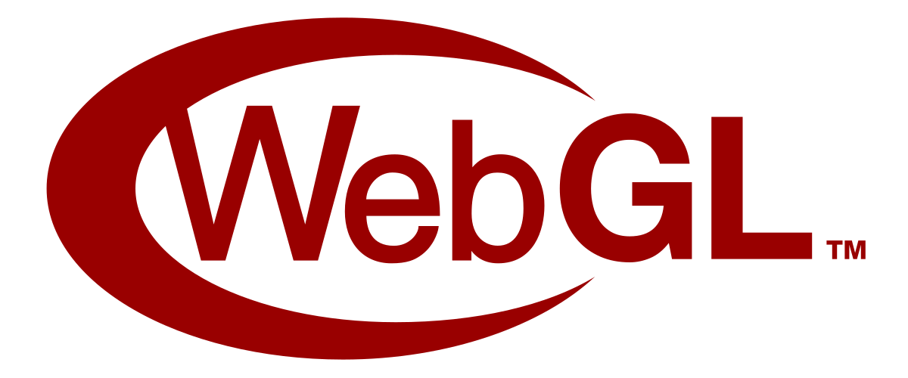

  
  
  
  

<h1 align="center">luma.gl | <a href="https://luma.gl">Docs</a></h1>

<h5 align="center">Portable WebGPU and WebGL rendering, GPU compute, and open 3D assets.</h5>

  
  &nbsp;&nbsp;
  
  &nbsp;&nbsp;
  
  &nbsp;&nbsp;
  

<small>WebGPU logo by <a href="https://www.w3.org/">W3C</a>, licensed under CC BY 4.0. Khronos marks belong to The Khronos Group.</small>

## Overview

luma.gl is a modular GPU toolkit for the web. Its portable device API stays close to WebGPU while
supporting both WebGPU and WebGL 2, from low-level shaders and resources to physically based scenes,
open 3D assets, animation, and data visualization.

- Portable graphics resources, render pipelines, and compute capabilities where WebGPU supports
  them.
- Composable GLSL/WGSL shader modules, physically based materials, lighting, and image-based
  environments.
- Shared scenegraph, animation, morph-target, model, and resource-management primitives.
- First-class glTF 2.0 assets, physical materials, skeletal/morph animation, and supported glTF
  extensions.
- An experimental, private retained scene interface built in the spirit of the ANARI object model.

Applications can adopt the modules they need without taking on an independent renderer, a
parallel material implementation, or a monolithic scene runtime.

> **Standards identity:** The experimental `@luma.gl/scene` package is independently developed and
> inspired by concepts from the Khronos ANARI standard. It is not an official ANARI implementation, is not certified or
> conformant, and is not affiliated with or endorsed by The Khronos Group. glTF, WebGL, and ANARI
> trademarks belong to their respective owners.

While generic enough to be used for general 3D rendering, luma.gl's mandate is primarily to support GPU needs of data visualization frameworks in the vis.gl suite, such as:

- [kepler.gl](https://github.com/keplergl/kepler.gl) a powerful open source geospatial analysis tool for large-scale data sets
- [deck.gl](https://github.com/visgl/deck.gl) a WebGL-powered framework for visual exploratory data analysis of large data sets
- [streetscape.gl](https://github.com/uber/streetscape.gl) A visualization toolkit for autonomy and robotics data encoded in the XVIZ protocol

# Installation, Running Examples etc

For details, please refer to the extensive [online website](https://luma.gl).
