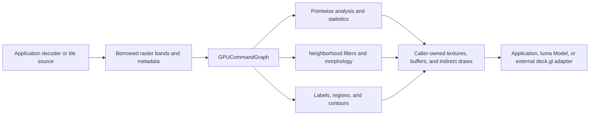

# LuRaster Roadmap

- **Status:** Active; foundational contracts complete and pointwise analytics in progress
- **Target API:** `@luma.gl/experimental/luraster`
- **Execution model:** WebGPU `GPUCommandGraph` contributors
- **Positioning:** GPU-resident raster analytics complementing `@luma.gl/experimental/geospatial`

## Overview

LuRaster is a proposed, independently implemented WebGPU raster-analysis toolkit inspired by the
image-processing scope of cuCIM. It adds georeferenced image operations to luma.gl command graphs
without importing cuCIM, CUDA, image codecs, Apache Arrow, deck.gl, or projection libraries into
the runtime.

An application supplies decoded, caller-owned raster bands as WebGPU textures or packed GPU
buffers. LuRaster contributors declare explicit compute, copy, and optional render passes against
those resources. One compiled graph can then be encoded repeatedly while compatible inputs are
replaced. Command submission, network access, decoding, resource ownership, and GPU readback remain
application decisions.

The initial product is two-dimensional raster analysis: validity-aware band math, normalized
difference vegetation index (NDVI), statistics, histograms, contrast adjustment, spatial filters,
thresholding, morphology, connected components, region measurements, contour extraction, and
bounded tiled processing. Three-dimensional microscopy, sophisticated segmentation, reprojection,
and frequency-domain algorithms are separate, evidence-gated extensions.

Official cuCIM references:

- [cuCIM documentation](https://docs.rapids.ai/api/cucim/stable/).
- [cuCIM API reference](https://docs.rapids.ai/api/cucim/stable/api/).
- [cuCIM third-party license notices](https://github.com/rapidsai/cucim/blob/main/LICENSE-3rdparty.md).

## Goals

1. Add a side-effect-free `./luraster` subpath to the existing experimental package.
2. Express every GPU operation as a `GPUCommandGraphContributor` with explicit resource uses.
3. Preserve caller ownership of imported textures, buffers, and output allocations.
4. Keep raster metadata, band calibration, nodata, validity, affine transforms, CRS, tile origins,
   overview levels, and neighborhood halos explicit.
5. Compose existing reductions, histograms, scans, grouped aggregation, transient planning,
   indirect dispatch, and indirect drawing where their actual contracts allow.
6. Support `float32`, `uint32`, and `sint32` working data without silently converting precise
   integers into floating-point values.
7. Deliver deterministic or explicitly documented semantics for borders, nodata, threshold ties,
   labeling, overflow, connectedness, tile seams, and approximate percentile calculations.
8. Demonstrate useful satellite and microscopy workflows without GPU-to-CPU synchronization
   between processing stages.
9. Keep browser decoding, GeoTIFF/COG access, worker pools, deck.gl rendering, Arrow adaptation,
   and coordinate reprojection outside the LuRaster runtime.
10. Validate correctness against CPU reference implementations, real WebGPU execution, package
    boundary tests, ownership tests, bounded-memory fixtures, and repeatable diagnostics.

## Non-goals

- Porting cuCIM source, kernels, CUDA abstractions, Python APIs, OpenSlide, or NVIDIA codecs.
- Registering a global plugin, introducing a graph plugin registry, or creating another workspace.
- Supporting WebGL through hidden emulation or silently falling back to CPU execution.
- Implicit command submission, GPU mapping, readback, resource packing, or graph recompilation.
- Claiming that a CRS identifier alone performs reprojection or establishes geodesic area.
- Treating ordinary rendering mipmaps as valid nodata-aware analytical overviews.
- Assuming the existing `GPUFFT2D` primitive is already a graph-native raster convolution
  contributor or supports arbitrary image dimensions.
- Claiming a repository package named `luSpatial`: the implemented vector sibling is
  `@luma.gl/experimental/geospatial`.
- Shipping a public npm package without a deliberate decision about the existing experimental
  package's current `"private": true` setting.
- Promising complete cuCIM feature parity. NDVI, marching squares, and possible watershed support
  are independent LuRaster capabilities, not verified cuCIM public-API equivalents.

## Existing repository foundation

| Capability                        | Existing location                                                                        | LuRaster implication                                                                          |
| --------------------------------- | ---------------------------------------------------------------------------------------- | --------------------------------------------------------------------------------------------- |
| Graph contributor contract        | `modules/experimental/src/gpu-primitives/gpu-command-graph.ts`                           | Algorithms implement `addToGraph(graph)`; no registry is needed.                              |
| Optional algorithm subpaths       | `modules/experimental/package.json`; `src/geospatial/index.ts`; `src/luxfilter/index.ts` | Add `./luraster` beside `./geospatial` and `./luxfilter`.                                     |
| Imported/transient graph textures | `gpu-command-graph.ts`; `gpu-command-graph-types.ts`                                     | Borrow input/output textures and declare graph-owned intermediate textures.                   |
| Texture graph integration tests   | `modules/experimental/test/gpu-primitives/gpu-command-graph-textures.spec.ts`            | Existing coverage proves storage-texture compute followed by sampled rendering.               |
| Typed packed buffer views         | `gpu-command-graph-types.ts`; `graph-data-view-utils.ts`                                 | Existing analysis primitives consume buffers, so texture bridges must be explicit.            |
| Hierarchical reduction            | `modules/experimental/src/gpu-primitives/gpu-reduction.ts`                               | Reuse `sum`, `min`, `max`, and `extent` with their additive validity-mask option.             |
| Masked scalar histogram           | `modules/experimental/src/gpu-primitives/gpu-histogram.ts`                               | Reuse equal-width/irregular histograms, but provide explicit valid-pixel domains.             |
| Unsigned scans                    | `modules/experimental/src/gpu-primitives/gpu-scan.ts`                                    | Reuse for cumulative distributions, dense labels, and contour offsets.                        |
| Bounded multidimensional dispatch | `modules/experimental/src/gpu-primitives/gpu-dispatch-utils.ts`                          | Reuse existing 3D planning/index helpers; `GPUScan` already uses them correctly.              |
| Unsigned compaction               | `modules/experimental/src/gpu-primitives/gpu-compaction.ts`                              | Reuse only for `uint32` IDs; float values and vertices require typed scatter.                 |
| Grouped statistics                | `modules/experimental/src/gpu-primitives/gpu-group-aggregation.ts`                       | Reuse dense label keys with masked count, sum, min, max, and mean.                            |
| Two-dimensional complex FFT       | `modules/experimental/src/gpu-primitives/gpu-fft2d.ts`                                   | Reuse bounded power-of-two transforms after designing an explicit graph-native adapter.       |
| Indirect drawing                  | `modules/experimental/src/gpu-primitives/draw-command-buffer.ts`                         | Write capacity-clamped segment counts directly into indirect draw records.                    |
| Indirect compute                  | `modules/engine/src/compute/computation.ts`                                              | Predeclared iterative passes may receive GPU-generated zero-work dispatches.                  |
| Existing subpath verification     | `scripts/verify-experimental-geospatial-package.mjs`                                     | Generalize or extend built ESM/CommonJS/declaration and root-isolation checks.                |
| Existing streaming example        | `examples/showcase/billion-point-spatial-atlas/ept-source.ts`                            | Adapt bounded source, cancellation, selection, and cache patterns; it is not a raster loader. |

Paths in the existing-location column's GPU primitive references are relative to
`modules/experimental/src/gpu-primitives/` when only a filename is shown.

### Existing contracts that must not change accidentally

`GPUHistogram({mask, domain: 'auto'})` deliberately computes its domain from the entire input,
then applies the mask only while counting. This behavior is explicitly covered by
`modules/experimental/test/gpu-primitives/gpu-histogram-mask.spec.ts` and supports stable linked
dashboard ranges. A finite nodata sentinel therefore corrupts a raster-specific automatic range
unless LuRaster computes a separate masked extent and passes it as an explicit GPU domain.

`GPUCompaction` accepts only `GraphDataView<'uint32'>` and matching `GraphVectorView<'uint32'>`.
It cannot compact `float32` samples, `float32x2` vertices, or label-pair records. Use `GPUScan`
over unsigned flags/counts followed by an appropriately typed scatter kernel when those outputs
are required.

Imported graph textures have fixed dimensions, format, layers, mips, and sample count. Replacing a
tile with a different shape requires either padding into the original descriptor or compiling a
distinct shape-specific graph. Graph hazards distinguish texture mip/layer/aspect ranges, not
disjoint XY rectangles. Halo transfers and seam writes must therefore declare explicit resources.

`GPUFFT2D` already implements an independently reusable two-dimensional complex radix-2
transform. It accepts caller-owned storage buffers and a caller-owned command encoder, but is
not a `GPUCommandGraphContributor`. Its dimensions must be powers of two from 2 through 2048,
and support depends on workgroup, storage-binding, and buffer-size limits. Initial raster
convolution remains direct or separable; future spectral filtering must first define explicit
graph resource declarations, real-to-complex packing, padding, boundary semantics, ownership,
and a measured kernel-size crossover.

### Shared FFT architecture and the proposed LuFFT subpath

`SpectralOceanSimulation` already uses the existing `GPUFFT2D` primitive for three inverse
transforms per update. The transform is public through `@luma.gl/experimental`, and its current
constructor, caller-owned buffers, encoder-based `encode` method, and ocean integration must
remain compatible.

The current implementation is reusable but not graph-native: `GPUFFT2D.encode` prepares its
computation and opens a compute pass, while a graph compute-node callback receives an already
open compute pass. Invoking the existing encoder-based method from that callback would nest GPU
passes and fail validation. A graph copy/pass-independent callback can mechanically call the
existing method, but doing so misclassifies compute work, hides transform-owned scratch from
graph allocation statistics, and prevents proper graph compute timings. Treat that escape hatch
as an explicitly temporary adapter, not the intended architecture.

The preferred graph-native contributor should:

1. Accept separate, packed `GraphDataView<'float32x2'>` complex input and output views plus
   explicit dimensions and transform direction.
2. Reuse the existing radix-2 WGSL, stage planner, normalization rules, and capability checks
   instead of copying ocean-specific kernels.
3. Allocate one graph-owned transient complex scratch buffer and declare input, output, and
   scratch resource hazards explicitly. Keep initialized stage-parameter uniforms node-owned and
   report their separate lifetime/memory costs.
4. Register one real graph compute node that records every ordered butterfly stage into the
   graph-provided compute pass, preserving the existing single-pass execution shape.
5. Initialize immutable uniforms before encoding, avoid parent-encoder updates inside the active
   pass, and destroy only contributor-owned computation/uniform allocations.
6. Split individual stages into separate graph nodes only when their added scheduling visibility
   or timing evidence justifies the additional compute-pass overhead.

FFT belongs to multiple domains, including ocean simulation, image processing, signal analysis,
convolution, and correlation. Its graph-native family should therefore live in a separate
optional `@luma.gl/experimental/lufft` subpath rather than inside `./luraster`. Preserve the
existing experimental-root `GPUFFT2D` export; the new subpath can re-export that compatibility API
alongside new graph contributors without introducing another npm workspace.

| LuFFT tranche | Outcome                                                                                 | LuRaster dependency |
| ------------- | --------------------------------------------------------------------------------------- | ------------------- |
| L0            | Optional `./lufft` ESM/CommonJS/types export, package-boundary tests, and compatibility | None                |
| L1            | Graph-native complex 2D transform with graph-owned scratch and explicit hazards         | Future spectral use |
| L2            | Real/complex packing, power-of-two padding, validity, and boundary semantics            | Future spectral use |
| L3            | Spectral multiply, convolution/correlation, and measured spatial crossover              | Future spectral use |
| L4            | Batched transforms and optional ocean graph migration                                   | Independent         |
| L5            | Evidence-gated non-power-of-two, larger-axis, or volumetric transforms                  | Independent         |

LuRaster tranche 7.4 consumes LuFFT L1–L3 when spectral convolution is justified. LuFFT and
ocean migration do not block the LuRaster package or raster-contract pull requests.

## Architecture



### Package and dependency boundaries

The implementation belongs under `modules/experimental/src/luraster/` and is imported as:

```ts
import {GPUCommandGraph} from '@luma.gl/experimental';
import {
  GPURaster,
  GPURasterContours,
  GPURasterHistogram,
  GPURasterNDVI
} from '@luma.gl/experimental/luraster';
```

Proposed runtime dependencies remain limited to existing experimental-package dependencies:
`@luma.gl/core`, `@luma.gl/engine`, `@luma.gl/shadertools`, and `@luma.gl/tables`. No
`apache-arrow`, deck.gl, loaders.gl, GeoTIFF decoder, projection database, browser fetch client,
or codec belongs in this package.

`modules/experimental/package.json` currently marks the package private. Adding an import subpath
does not change that status. Public distribution, API graduation, and any future extraction into
another package require a separate repository-wide decision.

The installed ocular build tools already enumerate conditional `exports` entries and generate
CommonJS output for each `require` target. The existing TypeScript project includes `src/**/*` and
therefore emits the new ESM files and declarations. An additional build system is unnecessary.

### Proposed raster data contracts

These names and signatures are illustrative design targets, not existing repository exports.

```ts
type GPURasterScalarFormat = 'float32' | 'uint32' | 'sint32';

type GPURasterTextureFormat<Format extends GPURasterScalarFormat> = Format extends 'float32'
  ? 'r32float' | 'rgba32float'
  : Format extends 'uint32'
    ? 'r32uint' | 'rgba32uint'
    : 'r32sint' | 'rgba32sint';

type GPURasterBand<Format extends GPURasterScalarFormat = GPURasterScalarFormat> =
  Format extends GPURasterScalarFormat
    ? {
        id: string;
        format: Format;
        storage:
          | {kind: 'buffer'; values: GraphDataView<Format>}
          | {
              kind: 'texture';
              view: GraphTextureView<GPURasterTextureFormat<Format>>;
              channel?: 0 | 1 | 2 | 3;
            };
        validity?: GraphDataView<'uint32'>;
        noDataValue?: number;
        scale?: number;
        offset?: number;
      }
    : never;

type GPURasterCoordinateReferenceSystem = {
  authority?: string;
  wellKnownText?: string;
  projectionJson?: Readonly<Record<string, unknown>>;
};

type GPURasterMetadata = {
  width: number;
  height: number;
  affine: readonly [number, number, number, number, number, number];
  pixelInterpretation: 'area' | 'point';
  coordinateReferenceSystem?: GPURasterCoordinateReferenceSystem;
  level?: number;
  levelZeroOrigin?: readonly [number, number];
};

type GPURasterTile = {
  key: string;
  level: number;
  column: number;
  row: number;
  corePixelBounds: readonly [number, number, number, number];
  availablePixelBounds: readonly [number, number, number, number];
  halo: number;
  raster: GPURaster;
};

type GPURasterContourOutput = {
  /** Two consecutive local positions for each retained segment. */
  positions: GraphDataView<'float32x2'>;
  /** Optional level identifier for each retained segment. */
  levels?: GraphDataView<'uint32'>;
  /** Retained segment count, clamped to the available segment capacity. */
  count: GraphDataView<'uint32'>;
  overflow: GraphDataView<'uint32'>;
  totalCount?: GraphDataView<'uint32'>;
  /** Double-precision world-space origin for local float32 positions. */
  origin: readonly [number, number];
  affine: readonly [number, number, number, number, number, number];
  coordinateReferenceSystem?: GPURasterCoordinateReferenceSystem;
};
```

The distributive `GPURasterBand` conditional preserves the relationship between `format` and
the corresponding texture/buffer storage even when callers use the default scalar-format union.
Runtime validation still rejects channel indices that the selected one- or four-channel format
cannot represent. Contour position capacity is measured in pairs; count and optional level rows
describe segments, not individual vertices.

Each band has one declared representation. A texture and buffer containing equivalent values are
independent resources unless an explicit LuRaster bridge contributor connects them. The runtime
must not maintain an invisible duplicate, silently synchronize copies, or take ownership of a
borrowed resource.

Packed buffer bands are initially tightly packed, row-major, and contain exactly
`width * height` samples. Padded rows, interleaving, channel extraction, array layers, and
multi-mip inputs are explicit adapters or later extensions. Storage texture views contain exactly
one mip. Analytical output formats default to `r32float`, `r32uint`, or `r32sint`; display
conversion to formats such as `rgba8unorm` is an explicit presentation pass.

### Nodata and calibration contract

Validity is evaluated in the following order:

1. Reject zero values in an explicit `uint32` validity mask.
2. Compare the raw source sample with the declared raw nodata sentinel.
3. Reject NaN or infinity for floating-point analytical samples.
4. Apply the band's scale and offset exactly once to accepted samples.
5. Intersect validity across every source band consumed by an operation.
6. Apply operation-specific rejection, including a zero or near-zero NDVI denominator.

An invalid floating-point output may contain canonical NaN; invalid integer output uses a
documented placeholder plus an explicit validity mask. Consumers use the validity contract, not
the placeholder payload, to determine whether a pixel participates.

An integer band with fractional calibration requires an explicit output promotion to `float32`;
there is no implicit format-preserving fractional integer result. Such promotion must disclose
that unsigned inputs above `2^24` may lose precision. Exact raw-domain integer extrema, nodata
comparisons, histograms, and labels remain integer operations. Calibrated output metadata resets
its scale/offset to identity so a downstream operation cannot apply the same calibration twice.

For valid-pixel extrema across all scalar formats, the preferred reusable addition is:

```ts
new GPUReduction({
  input: values,
  mask: validPixels,
  output: validExtent,
  operation: 'extent'
}).addToGraph(graph);

new GPUHistogram({
  input: values,
  mask: validPixels,
  domain: validExtent,
  output: histogramCounts
}).addToGraph(graph);
```

The additive `mask` option validates view kind, length, chunk topology, graph ownership, output
aliasing, and the all-masked case. Integer
min/max/extent need validity propagation even though existing unmasked integer reductions do not.
Masked sums ignore rejected rows. Existing unmasked reduction behavior and the documented
`GPUHistogram` automatic-domain behavior remain unchanged.

Existing integer `GPUReduction` sums and unsigned histogram/group counts wrap modulo `2^32`.
Exact integer sums, means, and cross-tile population totals therefore need either an explicit
bounded-total/overflow contract or a separately designed multiword accumulator. Existing
`GPUGroupAggregation` intensity inputs are `float32` only: integer region intensities must be
explicitly converted with disclosed precision limits, or wait for independently reviewed exact
integer grouped aggregation.

A restricted float-only first implementation may convert invalid gathered samples to NaN before
an existing `min`, `max`, or `extent` reduction. This shortcut does not work for sums and must not
convert large `uint32` values to `float32`: integers above `2^24` cannot all be represented
exactly.

### Spatial metadata and numeric precision

For `affine = [a, b, c, d, e, f]`:

```text
worldX = a * (column + centerOffset) + b * (row + centerOffset) + c
worldY = d * (column + centerOffset) + e * (row + centerOffset) + f
centerOffset = 0.5 for area pixels, 0 for point pixels
pixelAreaInCoordinateUnits = abs(a * e - b * d)
```

The model supports rotation, shear, north-up rasters with negative Y scale, non-square pixels,
and an explicitly invertible transform. Affine coefficients, tile origins, and CRS information
remain JavaScript double-precision metadata. GPU-generated positions should be local
`float32x2` offsets relative to a separately retained high-precision origin, avoiding
catastrophic cancellation in Web Mercator or projected national-coordinate systems.

An affine determinant reports square coordinate units. If the CRS uses angular degrees, it does
not describe square meters. Geodesic area, reprojection, datum transformation, axis-order
conversion, and mismatched-grid alignment require explicit application adapters. Multi-band
operations reject incompatible dimensions, affine transforms, pixel conventions, or CRS metadata
unless a separately declared resampling step has aligned the inputs.

Overview and tile coordinates must explicitly identify their reference frame. A level's affine
transform incorporates its downsample factor while retaining the chosen pixel-center convention;
tile requests record whether their origins are expressed in level-zero or current-level pixels.

### Ownership and command recording

- `GPURaster` and its bands are metadata views, not implicit texture or buffer owners.
- Caller-owned input textures, output textures, scalar buffers, masks, indirect commands, and
  result buffers remain alive after contributor or compiled-graph destruction.
- Scratch resources come from `graph.createTransientBuffer` or `graph.createTransientTexture`;
  compatible nonoverlapping lifetimes may reuse physical allocations.
- Every algorithm declares exact sampled/storage/copy/indirect resource uses and dependencies.
- A node creates its `Computation` in `compile`, resolves concrete imports in `encode`, and
  destroys only its own computation in the compiled-node destroy callback.
- `addToGraph` and `encode` never submit, map, await, read back, fetch, decode, or allocate
  replacement resources.
- Graph copy passes record through the caller-owned `CommandEncoder`. Do not invoke texture
  convenience methods that allocate another encoder and submit work implicitly.
- Uploading decoded CPU samples is an explicit application step before graph encoding.
- CPU inspection and timestamp retrieval are explicit post-submit operations only.

### WebGPU capabilities and scale limits

Baseline kernels require a WebGPU device, storage-capable formats, compatible workgroup sizes,
bounded dispatch dimensions, and buffer bindings below the active adapter's limits. Query
`device.getTextureFormatCapabilities(format).store` before storage writes and `.filter` before
requesting linear filtering. Compute shaders use `textureLoad` or `textureSampleLevel`; ordinary
`textureSample` cannot be used in compute.

Several existing analysis primitives still use 256-thread one-dimensional dispatch. At a common
`maxComputeWorkgroupsPerDimension` of 65,535:

```text
maximum rows in one current 1D pass = 65,535 * 256 = 16,776,960
pixels in a 4,096 x 4,096 raster = 16,777,216
required workgroups                 = 65,536
```

A full 4K-square raster therefore exceeds the existing 1D limit by one workgroup. Reduction,
histogram, mask, compaction, grid binning, and grid aggregation still contain affected passes.
`GPUScan` already uses the reusable bounded 3D helpers in `gpu-dispatch-utils.ts`; grouped
aggregation bounds its accumulation dispatch, although some output initialization/finalization
passes remain one-dimensional.

The lowest-risk initial solution is explicit bounded raster tiles or ordered stripe planning. The
Phase 1 planner reports safe, caller-managed stripe boundaries; it does not automatically rewrite
oversized reduction or histogram inputs. Future integrations can adapt the existing bounded
dispatch helpers, but must also change WGSL indexing: simply calling `dispatch(x, y, z)` is
incorrect while shaders read only `global_invocation_id.x`. Reduction partial ordering must
flatten group coordinates consistently, and the graph's already-correct scan ordering must
remain unchanged.

Some compatibility adapters expose fewer than 256 invocations per workgroup. Either adapt shared
primitive workgroup sizes or reject unsupported adapters explicitly. A `4096²` `float32` band
occupies 64 MiB, while an `8192²` band occupies 256 MiB and exceeds a common 128 MiB
storage-buffer binding limit. Tile budgeting must account for all simultaneous bands, masks,
scratch, halos, labels, and output geometry.

## Phase summary

Impact and cost are relative engineering estimates, not staffing or calendar commitments.

| Phase                            | Outcome                                                                      | Status      | Impact | Cost   |
| -------------------------------- | ---------------------------------------------------------------------------- | ----------- | ------ | ------ |
| 0 — Package foundation           | Approved scope, clean-room boundary, isolated imports, and CPU fixtures      | Complete    | High   | Small  |
| 1 — Raster contracts             | Metadata, validity, explicit bridges, masked statistics, and safe dispatch   | Complete    | High   | Large  |
| 2 — Pointwise analytics          | Band math, NDVI, histograms, contrast, and thresholding                      | In progress | High   | Medium |
| 3 — Neighborhood operators       | Border/nodata policies, convolution, gradients, and morphology               | Complete    | High   | Large  |
| 4 — Tiled processing             | Source adapters, safe residency, halos, valid overviews, and global merges   | In progress | High   | Large  |
| 5 — Segmentation and measurement | Deterministic labels, dense region IDs, statistics, and tile stitching       | Planned     | High   | Large  |
| 6 — Vector/raster integration    | Marching squares, indirect overlays, polygon sampling, and zonal statistics  | In progress | High   | Large  |
| 7 — Advanced extensions          | CLAHE, richer segmentation, 3D, and separately gated spectral filtering      | Deferred    | Medium | Large  |
| 8 — Productization               | Satellite/microscopy showcases, documentation, benchmarks, and release gates | Early slice | High   | Medium |

## Dependency-ordered tranche map

Each tranche represents one reviewable contract. Related tranches may share a pull request only
when their tests and rollback boundaries remain understandable.

| Tranche | Outcome                                                                       | Entry dependency                            | Cost   |
| ------- | ----------------------------------------------------------------------------- | ------------------------------------------- | ------ |
| 0.1     | Scope, licensing, API vocabulary, and explicit non-goals                      | None                                        | Small  |
| 0.2     | `./luraster` ESM/CommonJS/types subpath and package-boundary tests            | 0.1                                         | Small  |
| 0.3     | Deterministic CPU oracles, tiny fixtures, and GPU test harness                | 0.2                                         | Small  |
| 1.1     | Raster bands, formats, validity, calibration, affine, and CRS metadata        | 0.2                                         | Medium |
| 1.2     | Explicit packed texture-to-buffer and buffer-to-texture contributors          | 1.1, 0.3                                    | Medium |
| 1.3     | Opt-in masked reductions and raster-specific valid-pixel domains              | 1.2                                         | Medium |
| 1.4     | Bounded tiling/striping, dispatch planning, and adapter capability gates      | 1.2                                         | Large  |
| 2.1     | Pointwise band math, NDVI, and validity propagation                           | 1.1, 0.3                                    | Medium |
| 2.2     | Masked histogram, valid extent, mean, and percentile contracts                | 1.3, 1.4                                    | Medium |
| 2.3     | Linear stretch, gamma, global histogram equalization, and display conversion  | 2.1, 2.2                                    | Medium |
| 2.4     | Fixed thresholds and GPU-resident Otsu threshold selection                    | 2.1, 2.2                                    | Medium |
| 3.1     | Shared stencil, border handling, ping-pong, and nodata policies               | 1.1, 1.4                                    | Medium |
| 3.2     | Direct convolution and separable Gaussian/box smoothing                       | 3.1                                         | Medium |
| 3.3     | Sobel, Scharr, Laplacian, and edge magnitude                                  | 3.1                                         | Medium |
| 3.4     | Binary/grayscale dilation, erosion, opening, and closing                      | 2.4, 3.1                                    | Medium |
| 4.1     | Application-owned raster/GeoTIFF/COG tile-source interface                    | 1.1                                         | Medium |
| 4.2     | Capacity-bounded residency, cancellation, graph-shape cache, and rebinding    | 4.1, 1.4                                    | Large  |
| 4.3     | Explicit halo assembly, core-only writes, ragged edges, and seam parity       | 4.2, 3.1                                    | Large  |
| 4.4     | Nodata-aware overviews and multiresolution metadata                           | 4.2                                         | Medium |
| 4.5     | Global tiled extents, histogram merges, replay, and overflow-aware totals     | 4.2, 2.3, 2.4                               | Large  |
| 5.1     | Bounded deterministic 4/8-connected GPU component labeling                    | 2.4, 1.4                                    | Large  |
| 5.2     | Root flags, unsigned scan, dense labels, count, and overflow                  | 5.1                                         | Medium |
| 5.3     | Masked per-region area, centroid, and intensity statistics                    | 5.2, 1.3                                    | Medium |
| 5.4     | Cross-tile identities, region merges, and diagonal seam equivalences          | 5.3, 4.3, 4.5                               | Large  |
| 6.1     | Complete marching-squares case classification and saddle policy               | 2.1, 0.3                                    | Medium |
| 6.2     | Segment-count scan, bounded typed scatter, and GPU indirect drawing           | 6.1, 1.4                                    | Large  |
| 6.3     | Seam-safe contour ownership and example-only deck.gl integration              | 6.2, 4.3                                    | Medium |
| 6.4     | Explicit vector/raster point sampling, polygon masks, and zonal statistics    | 5.3, 4.5                                    | Medium |
| 7.1     | Adaptive thresholding and contrast-limited adaptive equalization              | 2.3, 3.2, 4.3                               | Large  |
| 7.2     | Evidence-gated marker-based or watershed-style segmentation                   | 5.3, 5.4                                    | Large  |
| 7.3     | Explicit volumetric, time, and multichannel microscopy contracts              | 3.1, 5.3                                    | Large  |
| 7.4     | LuFFT graph-native transforms and benchmarked raster spectral convolution     | 3.2, LuFFT L1–L3                            | Large  |
| 8.1     | Satellite, microscopy, tiled, and vector-overlay showcase examples            | 2.3, 3.2, 3.3, 3.4, 4.4, 4.5, 5.4, 6.3, 6.4 | Medium |
| 8.2     | Runtime guides, API references, both sidebars, and release notes              | Applicable feature tranche                  | Medium |
| 8.3     | Correctness matrix, adapter benchmarks, memory/ownership hardening            | 4.5, 5.4, 6.3, 6.4                          | Large  |
| 8.4     | Final formatting, full builds/tests, website builds, and package verification | 8.1, 8.2, 8.3                               | Medium |

### Current tranche status

- **2.1 complete:** `GPURasterBandMath` implements calibrated addition, subtraction,
  multiplication, division, normalized difference, optional explicit output clamping, and
  source-validity propagation. `GPURasterNDVI` specializes normalized difference without imposing
  an implicit output range. Both contributors preserve exact raw-domain nodata comparisons,
  reject non-finite operands and unstable denominators, and use bounded two-dimensional dispatch.
- **2.2 substantially complete:** `GPURasterHistogram` composes a nodata-aware validity mask, an
  explicit masked GPU extent, and caller-owned bins. `GPURasterStatistics` adds GPU-resident
  floating-band count, sum, mean, minimum, and maximum outputs. Caller-owned literal domains, GPU
  domains, and optional published automatic extents are available. Percentiles, wide counters,
  tiled global merges, and transparent 4K-plus reduction/histogram partitioning remain pending.
- **2.3 substantially complete:** `GPURasterContrast` implements calibrated linear stretching,
  gamma adjustment, and global histogram equalization through an inclusive GPU CDF scan.
  Percentile-domain estimation and dedicated `rgba8unorm` conversion remain pending.
- **2.4 complete for bounded histograms:** `GPURasterThreshold` provides inclusive/exclusive
  above, below, and range classification from fixed values or GPU-resident threshold views.
  `GPURasterOtsuThreshold` computes deterministic Otsu cutoffs entirely on the GPU; threshold
  masks alter real downstream histograms and scalar summaries.
- **3.1 complete for bounded packed-buffer neighborhoods:** `GPURasterNeighborhood` defines
  bounded rectangular stencils, `clamp`/`reflect`/`constant`/`nodata` borders, strict invalid
  propagation and valid-neighbor renormalization, calibrated raw-format nodata comparisons, and
  separate caller-owned output/value masks. Invalid center pixels never become valid. Tiled halo
  assembly remains a distinct Phase 4 contract.
- **3.2 complete for bounded spatial kernels:** `GPURasterConvolution` supports direct signed or
  nonnegative kernels, while `GPURasterGaussianBlur` and `GPURasterBoxBlur` compose normalized,
  separable horizontal/vertical passes with graph-owned intermediate scratch. The Raster Lab
  changes its rendered values, histogram, and scalar statistics when filter, radius, or sigma
  controls change. FFT-backed convolution remains explicitly deferred.
- **3.3 complete for bounded analytical derivatives:** `GPURasterGradient`, `GPURasterSobel`,
  and `GPURasterScharr` provide signed horizontal/vertical first derivatives;
  `GPURasterLaplacian` provides four- or eight-connected second derivatives; and
  `GPURasterGradientMagnitude` combines both first-derivative axes through graph-owned scratch.
  Explicit scaling, strict nodata propagation, caller-owned outputs, and interactive Raster Lab
  edge controls preserve the analytical command-graph contract.
- **3.4 complete for bounded binary and grayscale morphology:** `GPURasterMorphology`,
  `GPURasterDilation`, `GPURasterErosion`, `GPURasterOpening`, and `GPURasterClosing` implement
  radius-bounded square and Manhattan-diamond footprints, explicit border/nodata policies, and
  center-preserving validity. Binary contributors consume and publish exact `uint32` masks with
  distinct observation validity; grayscale contributors apply source calibration once and publish
  `float32` extrema. Opening and closing compose graph-owned typed intermediate values and
  validity, with a cumulative halo of twice the radius. The Raster Lab exposes every operation,
  both modes, both footprints, radius, nodata policy, and all border policies.
- **4.1 complete for application-owned decoded raster sources:** `GPURasterTileReader` validates
  application-supplied metadata, explicit source overview levels, requested coordinate frames,
  half-open windows, selected native-format bands, decoded validity, and `AbortSignal`
  cancellation. Tile metadata preserves the source CRS, affine transform, and level-zero origin.
  The Raster Lab switches among full/west/east windows and source-provided 1×/2× overviews
  without adding a decoder, HTTP client, tile cache, implicit GPU upload, or pixel readback.
- **4.2 next:** capacity-bounded residency, explicit eviction/fence ownership, graph-shape reuse,
  and coordinated multi-request tile scheduling remain a separate tiled-processing tranche.
- **6.1 complete for single-level contours:** `GPURasterContourClassifier` classifies every
  marching-squares case, uses an explicit greater-than-or-equal threshold policy, resolves
  diagonal saddles with a deterministic bilinear decider, and rejects invalid source corners.
- **6.2 complete for bounded single-raster output:** `GPURasterContours` composes GPU
  classification, unsigned prefix scan, stable bounded line scatter, clamped/required counts,
  overflow publication, and optional GPU-written indirect draw instances. The Raster Lab renders
  its resulting line overlay without reading a draw count. Tile stitching and external deck.gl
  integration remain in Tranche 6.3.
- **8.1 and 8.2 early slices:** a small interactive raster-lab example and initial API reference
  demonstrate the current source-window/overview/NDVI/smoothing/gradient/morphology/histogram/
  contour workflow. The full
  satellite/microscopy/tiled/vector showcase matrix, broader documentation set, benchmarks, and
  final release gates remain pending.

## Detailed tranche definitions

### Tranche 0.1 — Scope and clean-room review

**Entry:** Existing graph texture, geospatial, and LuxFilter contracts are available.

**Work:** Confirm the isolated subpath, 2D-first scope, explicit graph ownership, GPU-only
execution, supported working formats, independent algorithm implementation, and deferred
graph-native spectral filtering.
Document the actual vector sibling name and private-package publication boundary.

**Exit evidence:** Reviewers approve the architecture, dependency exclusions, licensing rules,
MVP definition, and non-goals before implementation begins.

### Tranche 0.2 — Experimental package subpath

**Entry:** Tranche 0.1.

**Work:** Add `modules/experimental/src/luraster/index.ts` and the `./luraster` conditional
`import`/`require`/`types` export. Add an isolated package-boundary node test. Generalize the
built-package verifier or add an analogous independently runnable LuRaster verifier.

**Exit evidence:** Built ESM, CommonJS, and declarations resolve from
`@luma.gl/experimental/luraster`. Raster runtime symbols do not appear in the main experimental
barrel. Existing geospatial/LuxFilter imports, `sideEffects: false`, and package privacy remain
unchanged.

### Tranche 0.3 — CPU reference and GPU fixtures

**Entry:** Tranche 0.2.

**Work:** Provide deterministic tiny rasters, float/integer patterns, finite nodata sentinels,
NaNs, affine fixtures, 1x1/odd-size images, and CPU reference helpers. Establish node-only
metadata tests and WebGPU correctness tests that skip explicitly when no adapter exists.

**Exit evidence:** Fixtures run offline, expected results are reproducible, GPU readback occurs
only inside test verification, and package tests do not require external imagery. At least one
browser/headless CI job must execute real WebGPU assertions; a run where every WebGPU test skips
is not a passing implementation gate.

### Tranche 1.1 — Raster metadata and storage contracts

**Entry:** Tranche 0.2.

**Work:** Introduce `GPURaster`, scalar bands, borrowed texture/buffer representations,
source-aligned validity masks, raw nodata, scale/offset, full affine metadata, CRS identity,
pixel interpretation, overview level, and tile origin. Validate shape, graph ownership,
single-mip storage views, format compatibility, and explicit grid equality.

**Exit evidence:** Tests cover odd dimensions, negative Y scale, rotation/shear, non-square
pixels, invalid affine determinants, CRS mismatches, invalid channels, integer precision, and
borrowed-resource survival after graph destruction.

### Tranche 1.2 — Texture/buffer interoperability

**Entry:** Tranches 1.1 and 0.3.

**Work:** Implement an explicit texture-gather contributor that uses compute `textureLoad` to
produce tightly packed `GraphDataView` values and a canonical `uint32` validity mask. Add the
reverse scatter contributor and explicit display conversion. Apply raw nodata before
calibration; preserve raw scalar format unless a caller explicitly requests calibrated
floating-point conversion. Fractional calibration and large-integer precision loss are visible
parts of that conversion contract.

**Exit evidence:** Odd-width rows, channel selection, offsets, NaNs, finite sentinels, signed
values, and unsigned values above `2^24` match CPU expectations. Texture-copy row padding is not
mistaken for a packed analysis buffer. All resources have declared graph hazards.

### Tranche 1.3 — Validity-aware reductions

**Entry:** Tranche 1.2.

**Work:** Add an optional aligned `uint32` mask to `GPUReduction` if shared primitive review
approves it. Propagate validity through first-level and multi-chunk integer/floating reductions;
define masked `sum`, `min`, `max`, `extent`, and all-invalid outputs. Build explicit raster
extent buffers and pass those buffers into `GPUHistogram`.

**Exit evidence:** Float NaNs, finite integer nodata, exact maximum unsigned values, masked sums,
empty chunks, all-invalid tiles, and repeated encoding match CPU references. Existing unmasked
reductions and the explicitly tested unmasked `GPUHistogram` automatic-domain behavior remain
unchanged.

### Tranche 1.4 — Dispatch and capacity hardening

**Entry:** Tranche 1.2.

**Work:** Implement adapter capability checks and explicit, ordered buffer-stripe planning that
accounts for existing 256-byte graph binding alignment, storage limits, and the current
256-invocation reduction/histogram kernels. Raster texture contributors use independently bounded
two-dimensional dispatch. Keep stripe materialization caller-owned during this phase; do not
claim that large monolithic reduction or histogram views are transparently partitioned. Reuse
the existing bounded 3D dispatch helpers for any later approved generic primitive adaptation.

**Exit evidence:** Tests cover `limit - 1`, `limit`, and `limit + 1` workgroups; the
`4096 x 4096` threshold; oversized `8192 x 8192` binding requests; 128-invocation compatibility
devices; and adapter-specific storage, texture, and workgroup limits. Every raster texture
contributor dispatch is validated before graph encoding. Oversized generic reduction/histogram
views remain unsupported until callers apply their explicit stripe/tile plans or Tranche 2.2
adds a cross-package-safe materialization path.

### Tranche 2.1 — Pointwise math and NDVI

**Entry:** Tranches 1.1 and 0.3.

**Status:** Complete for the bounded two-input operation contract; richer unary expressions are
independently deferred.

**Work:** Add independently composable calibrated binary addition, subtraction, multiplication,
division, normalized difference, explicit optional clamping, source-validity intersection, and
`GPURasterNDVI`. Compute
`(nearInfrared - red) / (nearInfrared + red)` after independently applying each band's
calibration. Intersect validity and reject denominators whose absolute value is at most the
configured epsilon.

**Exit evidence:** CPU parity covers raw nodata before calibration, unequal scales, NaNs,
negative values, zero denominators, mismatched grids, graph reuse, separate output allocations,
and no implicit submission/readback. Do not assume NDVI lies in `[-1, 1]` unless inputs meet the
required nonnegative-reflectance assumptions.

### Tranche 2.2 — Histograms and scalar summaries

**Entry:** Tranches 1.3 and 1.4.

**Status:** Substantially complete. Validity-aware fixed-size histograms, masked GPU extents,
and floating-band count/sum/mean summaries are implemented; percentile, overflow, and automatic
large-raster partitioning contracts remain pending.

**Work:** Compose explicit valid-pixel extent, masked histogram, valid count, sum, minimum,
maximum, and mean. Exact integer min/max/extents and histograms remain in the raw integer domain;
floating sums/means use `float32`. Integer sums expose the existing modulo-`2^32` behavior plus an
overflow indication, or require a separately approved wide accumulator. Support caller-owned
fixed domains, explicit GPU domains, irregular edges, and histogram-estimated percentiles with
documented bin-resolution error. Before advertising monolithic 4K-plus reduction/histogram
support, either adapt both primitives with the existing bounded 3D WGSL helpers or add a
root-owned graph-vector factory that materializes source/mask stripes with matching chunk
boundaries, separately budgeted nonzero binding offsets, and verified ESM/CommonJS class
identity.

**Exit evidence:** Finite nodata sentinels do not distort inferred domains; empty/all-invalid
images have defined output; irregular edges and exact maximum values match primitive contracts;
large `uint32` extrema and histogram boundaries remain exact; integer sum/count overflow and
any explicit float conversion are disclosed; repeated encoding clears output correctly.

### Tranche 2.3 — Contrast and global equalization

**Entry:** Tranches 2.1 and 2.2.

**Status:** Substantially complete. Reusable linear, gamma, and global CDF equalization
contributors are implemented; percentile-domain estimation and dedicated display conversion
remain pending.

**Work:** Add linear/percentile stretches, gamma adjustment, histogram equalization using an
inclusive unsigned CDF scan, and an optional `rgba8unorm` display conversion. Keep analytical
values and validity separate from presentation colors.

**Exit evidence:** Monotonic mappings, degenerate domains, one-bin distributions, all-invalid
tiles, floating tolerance, exact nodata preservation, and visible grayscale/RGB examples match
CPU references. Any percentile approximation is labeled rather than presented as exact sorting.

### Tranche 2.4 — Thresholding and Otsu

**Entry:** Tranches 2.1 and 2.2.

**Status:** Complete for fixed-size, at-most-256-bin histograms. Inclusive/exclusive fixed and
GPU-resident thresholds and deterministic GPU-resident Otsu selection are implemented.

**Work:** Add explicit above/below/range threshold contributors and Otsu selection from a
bounded valid-pixel histogram. Keep threshold values on the GPU when consumed by a later pass.
Use a small local weighted-prefix implementation where needed; the existing public `GPUScan`
only supports `uint32` and cannot scan floating weighted sums.

**Exit evidence:** Threshold equality policy, Otsu tie breaking, uniform images, bimodal
fixtures, all-invalid input, signed data, and repeated encoding are stable and CPU-verifiable.

### Tranche 3.1 — Neighborhood execution contract

**Entry:** Tranches 1.1 and 1.4.

**Status:** Complete for bounded packed-buffer stencils. All four border modes, strict and
renormalized nodata policies, rectangular radii, exact source-format nodata, calibrated samples,
center-validity preservation, and separate output/value masks are implemented. Tile halos and
automatic large-raster partitioning remain separate Phase 4 work.

**Work:** Define operator radius, workgroup-local neighborhood tiles, separate input/output
resources, and border modes `clamp`, `reflect`, `constant`, and `nodata`. Define strict nodata
propagation and valid-neighbor renormalization for appropriate nonnegative smoothing kernels.
Require explicit halo coverage and forbid same-subresource in-place updates.

**Exit evidence:** 1x1, edge, corner, odd-size, radius-zero, missing-neighbor, and every border
mode match the CPU stencil oracle. Compute workgroups respect device limits and storage views
select one mip.

### Tranche 3.2 — Convolution and smoothing

**Entry:** Tranche 3.1.

**Status:** Complete for bounded spatial kernels. Direct signed/nonnegative convolution and
separable normalized Gaussian/box smoothing produce caller-owned values and validity; the two
smoothing passes reuse graph-owned intermediate scratch. Interactive Raster Lab controls drive
the analytical GPU graph, not a display-only image effect.

**Work:** Implement bounded direct convolution, separable box/Gaussian filters, reusable
intermediate scratch, kernel normalization, and explicit smoothing validity policy. Select direct
or separable spatial evaluation from declared kernel shape.

**Exit evidence:** Impulse response, constant image, ramps, Gaussian separability, signed kernel
coefficients, neighborhood nodata, and graph-reported scratch reuse match reference results.
No documentation claims FFT-backed acceleration.

### Tranche 3.3 — Gradients and edge detection

**Entry:** Tranche 3.1.

**Status:** Complete for bounded packed-buffer raster derivatives. Sobel/Scharr horizontal and
vertical gradients, four/eight-connected Laplacians, explicit positive coefficient scaling, and
three-pass gradient magnitude retain signed conventions, strict missing-neighbor validity, and
graph-owned scratch. The Raster Lab routes edge responses through its existing histogram,
threshold, contour, and indirect-rendering pipeline without downloading raster pixels. Derivatives
are measured in raster-pixel coordinates; world-space affine conversion remains application-owned.

**Work:** Implement Sobel, Scharr, Laplacian, directional gradients, and gradient magnitude.
Signed derivative filters use an explicit valid-neighborhood policy rather than applying
positive-weight smoothing renormalization.

**Exit evidence:** Horizontal/vertical/diagonal ramps, impulse edges, derivative sign, border
fixtures, and nodata-adjacent neighborhoods match CPU references within documented tolerances.

### Tranche 3.4 — Binary and grayscale morphology

**Entry:** Tranches 2.4 and 3.1.

**Status:** Complete for bounded packed-buffer raster morphology. Exact binary `uint32` masks and
calibrated grayscale `float32` extrema support dilation, erosion, opening, and closing over
square or Manhattan-diamond footprints. Separate validity preserves the distinction between
legitimate background and missing observations. All four border modes, strict/ignore nodata
policies, identity-radius behavior, graph-owned composite scratch, and cumulative halo metadata
are implemented. Interactive Raster Lab controls compose these operators with smoothing,
derivatives, thresholding, valid histograms, and scalar or binary contour overlays.

**Work:** Implement dilation and erosion for defined square/cross structuring elements and
compose opening/closing from explicit ping-pong passes. Define 4/8-neighborhood interpretation
and whether invalid pixels block propagation.

**Exit evidence:** Single-pixel islands, holes, checkerboards, touching diagonals, edge pixels,
all-invalid neighborhoods, and repeated erosion/dilation match CPU output without hidden
intermediate ownership.

### Tranche 4.1 — External raster tile source

**Entry:** Tranche 1.1.

**Status:** Complete for one application-owned asynchronous decoded raster tile at a time.
`GPURasterTileReader` validates metadata, native-format band descriptors, explicit source levels,
level-local/level-zero half-open request windows, anisotropic/ragged overview coverage,
caller-owned decoded samples/validity, coordinate metadata, and pre/post-decode cancellation.
The Raster Lab's synthetic adapter demonstrates full/west/east windows, 1×/2× source-provided
overviews, explicit CRS/origin, and stale-request cancellation without bundling a decoder.
Multi-tile residency, halo assembly, generated analytical overviews, and stitched results remain
separate later tranches.

**Work:** Define an application-supplied asynchronous tile-source interface with dataset
metadata, requested level, explicit coordinate reference frame, selected bands, spatial window,
and `AbortSignal`. Keep HTTP range requests, worker pools, GeoTIFF/COG decoding, credentials,
and codec choices in the caller or showcase adapter.

**Exit evidence:** A synthetic offline source and a separately owned GeoTIFF adapter satisfy the
same interface. Cancellation, overview selection, metadata propagation, and no loaders.gl
runtime dependency are verified.

### Tranche 4.2 — Bounded residency and graph reuse

**Entry:** Tranches 4.1 and 1.4.

**Status:** Next planned tranche; no cache, eviction policy, or graph-shape residency exists yet.

**Work:** Define an explicit CPU/GPU tile cache budget, LRU or viewport-priority eviction,
cancellation of stale requests, graph keys by shape/format/halo/overview, and compatible
per-encoding input replacement. Choose padded fixed-size boundary tiles or independent graph
variants; never mutate an already compiled graph. Pin every encoded or submitted tile import
until its application-owned submission completes and an explicit fence permits release;
cancellation stops future work but never destroys in-flight GPU resources.

**Exit evidence:** Capacity, concurrent requests, eviction ownership, replacement compatibility,
rapid viewport changes, canceled source loads, in-flight submission/fence pinning, and stable
compile counts are measurable. Eviction or cancellation during encoded/submitted work never
destroys a borrowed resource prematurely. Oversized images never allocate a complete
GPU-resident raster implicitly.

### Tranche 4.3 — Halo assembly and seam correctness

**Entry:** Tranches 4.2 and 3.1.

**Work:** Acquire a neighborhood that covers the complete composed pipeline receptive field,
including cumulative stage radii and any overview/resampling scale factors. For example,
Gaussian radius `R` followed by Sobel radius `1` requires `R + 1` source pixels, and an
erosion/dilation pair requires both stage radii. Declare texture-copy or compute halo-fill graph
passes explicitly. Apply border policy only at actual dataset edges, process padded intermediate
regions, and write only half-open owned core pixels.

**Exit evidence:** Tiled and monolithic pointwise, smoothing, derivative, morphology, chained
Gaussian→Sobel, and chained opening/closing results match at every interior seam, outer edge,
ragged tile, resampled overview, and nodata boundary. No algorithm assumes that the graph
distinguishes disjoint XY rectangles of one texture.

### Tranche 4.4 — Analytical overviews

**Entry:** Tranche 4.2.

**Work:** Support source-provided overviews plus explicit graph-generated numerical reductions.
Floating overview pixels carry `sum` and `validCount` before division. Integer categorical and
label overviews use a declared nearest/mode policy rather than averaging. Preserve overview
origin, resolution, affine scaling, and validity coverage.

**Exit evidence:** Missing source samples never darken or dilute valid aggregates; all-invalid
parent pixels remain invalid; category labels are not interpolated; neighboring levels share a
consistent level-zero spatial reference. Ordinary rendering mipmaps are never described as
analytical substitutes.

### Tranche 4.5 — Global tiled statistics and replay

**Entry:** Tranches 4.2, 2.3, and 2.4.

**Work:** Define a multi-pass, replayable tile contract. First merge valid per-tile extrema and
counts into caller-owned global extrema; then process every tile again with the resulting stable
GPU-resident domain, merging cleared per-tile histogram partials into a separately initialized
persistent global histogram. Derive global percentiles/Otsu thresholds before a third explicit
application pass. Keep partial buffers bounded, declare every merge and initialization pass, and
support replayable sources or explicitly cached decoded tiles. Document saturating counters,
overflow flags, a bounded-total rejection policy, or multiword `uint32` counters for total/bin
populations above `2^32 - 1`.

**Exit evidence:** Reordering tiles never changes global extent, counts, histograms, threshold
selection, or contrast domains. Re-encoding one tile graph does not erase prior merged results.
All-invalid tiles, mixed nodata sentinels, canceled/replayed loads, bounded partial memory, and
datasets with populations at, below, and above `2^32` match CPU references and explicit overflow
contracts without CPU result polling.

### Tranche 5.1 — Connected-component labeling

**Entry:** Tranches 2.4 and 1.4.

**Work:** Implement deterministic `uint32` union-by-minimum-root with explicit 4/8 connectivity,
separate graph passes for initialization, hooking, path compression, and convergence state.
Predeclare a bounded number of rounds. After convergence, a GPU-generated indirect dispatch may
set subsequent workgroup counts to zero. Publish whether the chosen round budget converged.
Gate every downstream label, dense-relabel, region-statistic, and render pass on that GPU
convergence state, or invalidate/clear every dependent output when convergence is not achieved.

**Exit evidence:** Empty masks, single islands, checkerboards, diagonal touching, long snakes,
nodata barriers, workgroup boundaries, exact iteration bounds, deterministic roots, and
nonconverged status match CPU labeling. A deliberately insufficient iteration budget produces
no plausible-looking dense labels, grouped statistics, or draws. No CPU convergence polling or
hidden readback occurs.

### Tranche 5.2 — Dense relabeling and bounded outputs

**Entry:** Tranche 5.1.

**Work:** Mark representative roots, apply `GPUScan` to unsigned root flags, and scatter dense
labels with background `0` and foreground `1..componentCount`. Return caller-owned count,
capacity-clamped count when appropriate, overflow, and optional unclamped totals. Use
convergence-controlled indirect dispatch or a validity-clearing pass before any dependent
output becomes visible.

**Exit evidence:** Sparse root IDs never index a compact region array directly. Repeated graph
execution produces stable labels; zero capacity, insufficient capacity, maximal checkerboards,
and overflow are explicit. Nonconverged component output cannot be consumed as valid.
Global identifiers never silently wrap past `uint32`.

### Tranche 5.3 — Per-region measurements

**Entry:** Tranches 5.2 and 1.3.

**Work:** Convert converged dense foreground labels to zero-based group IDs, mask
background/nodata, and compose `GPUGroupAggregation` for `uint32` pixel counts and
`float32`-only intensity sum/min/max/mean. Integer intensity bands require an explicit,
precision-disclosed float conversion or a separately gated exact-integer grouping primitive.
Compute row/column moments for centroids and apply the raster affine transform; report affine
area in square coordinate units. Preserve mergeable count/sum/min/max/moment partials for
subsequent cross-tile relabeling.

**Exit evidence:** CPU comparisons cover floating intensity bands, explicitly converted integer
bands, sparse regions, empty groups, rotated affines, non-square pixels, nodata holes,
nonconverged upstream labels, and maximum labels. Large integers are never described as exact
after conversion. Floating atomic sums document their nondeterministic accumulation order.
Geographic-degree CRS never claims square-meter area without an explicit external conversion.

### Tranche 5.4 — Cross-tile segmentation

**Entry:** Tranches 5.3, 4.3, and 4.5.

**Work:** Record equivalences across neighboring tile edges, including diagonal contacts for
8-connectivity. Resolve representative identities deterministically, apply a second dense global
mapping, and define either bounded global `uint32` IDs or explicit composite tile/local IDs for
larger datasets. Recompute or merge local region count, sum, minimum, maximum, and spatial
moments by the final global labels; calculate global means as merged sum divided by merged
count rather than averaging per-tile means.

**Exit evidence:** Components spanning two tiles, four-tile junctions, diagonal-only seams,
nodata seam barriers, different tile arrival orders, merged centroids, weighted means, limited
capacity, and datasets exceeding the global ID or population domain match the declared CPU
oracle and overflow behavior.

### Tranche 6.1 — Marching-squares classification

**Entry:** Tranches 2.1 and 0.3.

**Status:** Complete for one literal or GPU-resident contour level per contributor. Independent
contributors may classify multiple levels in the same graph; batched multilevel specialization
remains a possible future optimization.

**Work:** Classify `(width - 1) * (height - 1)` raster cells at one or more contour levels.
Define exact-threshold comparison, flat-cell handling, edge interpolation, and a consistent
bilinear/asymptotic decider for ambiguous cases 5 and 10. Exclude cells with invalid corners.

**Exit evidence:** All sixteen cases, both saddle orientations, equal-valued corners, exact
threshold ties, NaNs, finite nodata, boundaries, and rotated affine metadata produce stable,
documented classifications.

### Tranche 6.2 — GPU contour geometry and indirect drawing

**Entry:** Tranches 6.1 and 1.4.

**Status:** Complete for bounded single-raster output with deterministic segment order,
caller-owned geometry/counts, optional overflow diagnostics, and GPU-resident indirect drawing.

**Work:** Write zero, one, or two segments per cell; scan unsigned segment counts; scatter typed
`float32x2` positions into caller-owned bounded output; publish a clamped count, overflow, and
optional total count. Configure `DrawCommandBuffer` with two vertices per segment instance and
write the clamped instance count directly into its borrowed count view.

**Exit evidence:** Segment order is stable, interpolation agrees with CPU references, every
capacity boundary is enforced, maximum two-segment cases do not overwrite storage, and an
indirect line draw succeeds without reading the segment count on the host.

### Tranche 6.3 — Tile seams and external overlays

**Entry:** Tranches 6.2 and 4.3.

**Work:** Add one-pixel contour halos and half-open global cell ownership so an adjacent tile
neither duplicates nor drops a boundary cell. Publish local `float32` positions, high-precision
origin, affine, CRS, levels, counts, and caller-owned buffers. Build a custom deck.gl consumer
only in an example or separate adapter.

**Exit evidence:** Adjacent contour tiles have no cracks or duplicate segments; saddle decisions
agree across seams; the overlay consumes GPU-generated buffers directly; and no deck.gl or Arrow
dependency enters the LuRaster package.

### Tranche 6.4 — Vector/raster composition and zonal statistics

**Entry:** Tranches 5.3 and 4.5 plus the existing optional geospatial subpath.

**Work:** Demonstrate application-level graph composition between raster sample positions and
existing geospatial point/polygon queries. Define exact pixel-center sampling, polygon boundary
classification, source-aligned zone masks or dense zone IDs, nodata intersection, and grouped
floating intensity statistics. A single dense zone ID represents exclusive/first-match zones;
overlapping membership requires an explicitly bounded `(pixelId, zoneId)` expansion with
unsigned scan, typed scatter, and overflow reporting. Preserve CRS/affine compatibility and
keep sibling subpaths independently importable rather than adding a mandatory geospatial
runtime dependency.

**Exit evidence:** Polygon holes, edge/boundary pixels, mixed CRS rejection, overlapping-zone
policy, nodata, tiled global merges, and unsigned count overflow match CPU references. Vector
analytics and raster analytics compose inside one caller-controlled graph with no CPU
intermediate readback and no mandatory deck.gl, Arrow, or reprojection imports.

### Tranche 7.1 — Adaptive local analysis

**Entry:** Tranches 2.3, 3.2, and 4.3.

**Work:** Add local thresholding and contrast-limited adaptive histogram equalization (CLAHE)
only after fixed-window memory, tile interpolation, clip redistribution, nodata treatment, and
adapter capabilities are specified.

**Exit evidence:** Local windows and tile boundaries agree with a CPU reference; clipping and
redistribution are deterministic; additional transient memory remains within the declared tile
budget.

### Tranche 7.2 — Advanced segmentation decision gate

**Entry:** Tranches 5.3 and 5.4 plus demonstrated application demand.

**Work:** Evaluate marker-based, distance-transform, region-growing, or watershed-style
segmentation against fixed graph topology, bounded iteration, nodata, memory, and deterministic
ties. Avoid describing watershed as verified current cuCIM public-API parity.

**Exit evidence:** An accepted algorithm has a written convergence/capacity contract, at least
two representative datasets, and GPU-only pass composition; otherwise this tranche remains
deferred.

### Tranche 7.3 — Volumetric microscopy decision gate

**Entry:** Tranches 3.1 and 5.3 plus approved 3D memory/metadata contracts.

**Work:** Specify Z spacing, multidimensional channel/time layout, `texture_3d` or tiled slab
storage, 6/18/26-connectivity, volume halos, and per-axis affine or physical-unit metadata.
Treat this as a new API contract rather than a transparent extension of 2D bands.

**Exit evidence:** At least one bounded-memory 3D microscopy consumer demonstrates correct
voxel connectivity and physical coordinates, or the feature remains deferred.

### Tranche 7.4 — LuFFT integration and raster spectral filtering

**Entry:** Tranche 3.2 plus completed LuFFT L1–L3 graph/spectral contributors.

**Work:** Compose the separate `@luma.gl/experimental/lufft` contributors with explicit raster
validity, real-to-complex packing, power-of-two padding, forward/inverse normalization, complex
kernel multiplication, boundary policies, adapter feature gates, and graph-owned scratch.
Evaluate spectral convolution only after comparing it against direct and separable kernels on
real adapters. Keep the existing `GPUFFT2D` root export and ocean simulation compatible.

**Exit evidence:** Graph-native LuFFT/raster composition agrees with CPU references, declares
its transient allocations and compute passes, documents error and memory costs, respects the
current 2048-pixel axis limit, and wins at a measured kernel-size crossover. Until then, this
tranche is deferred and never blocks the raster MVP.

### Tranche 8.1 — End-to-end showcase applications

**Entry:** Tranches 2.3, 3.2, 3.3, 3.4, 4.4, 4.5, 5.4, 6.3, and 6.4; these transitively include
the GeoTIFF source interface, tiled residency/halos, thresholding, and contour generation.

**Work:** Build a satellite workflow that decodes an external GeoTIFF, computes calibrated NDVI,
valid-pixel histograms, stretch, thresholds, and georeferenced contours. Build a microscopy
workflow combining smoothing, gradients, thresholding, morphology, connected components, and
region statistics. Include one vector/raster polygon-zonal comparison. Use committed synthetic
fixtures for CI.

**Exit evidence:** Both examples show one explicit command graph, caller-owned submission,
optional explicit result inspection, reusable compiled graphs, correct metadata, real headless
WebGPU execution, and no network requirement in automated tests.

### Tranche 8.2 — Documentation and release integration

**Entry:** Each feature tranche as its public contract stabilizes.

**Work:** Add `modules/experimental/src/luraster/README.md` and
`docs/api-reference/experimental/luraster/` guides. Add the raster category to both experimental
sections of `docs/table-of-contents.json`, update the experimental overview, and document new
features in `docs/whats-new.md`. Keep new features out of `docs/upgrade-guide.md`.

**Exit evidence:** Website links resolve, both sidebars contain the raster reference, examples
have honest compatibility requirements, and every public operation explains validity, ownership,
precision, and readback semantics.

### Tranche 8.3 — Benchmarking and hardening

**Entry:** Tranches 4.5, 5.4, 6.3, and 6.4.

**Work:** Record CPU encoding time, optional post-submit GPU timings, compile count, logical
resources, physical transient bytes, allocation reuse, tile residency, cancellation behavior, and
adapter identity. Measure `512²`, `2048²`, `4096²`, and bounded `8192²` tiled datasets.

**Exit evidence:** Correctness and hard resource limits are test gates. Hardware-dependent
throughput is documented as a diagnostic baseline, never an assumed portable CI threshold.
Device loss, repeated destruction, canceled work, and borrowed-resource lifetimes are covered.
At least one browser/headless job reports executed WebGPU assertions; all-skipped GPU suites
cannot satisfy this gate.

### Tranche 8.4 — Final integration verification

**Entry:** Tranches 8.1, 8.2, and 8.3 for the selected release milestone.

**Work:** Run the repository's required formatting, package, node/headless, and website
verification commands after final code changes. Confirm built subpath exports, no forbidden
runtime imports, both showcase registrations, and clean targeted diffs.

**Exit evidence:** The chosen release meets its milestone checklist, `yarn build` and
`yarn test` pass after the final formatting changes, both website build paths pass when docs or
examples changed, and all skipped setup checks are explicitly reported.

## Target implementation touchpoints

### New runtime and test files

```text
modules/experimental/src/luraster/
  index.ts
  types.ts
  gpu-raster.ts
  raster-utils.ts
  gpu-raster-buffer-adapter.ts
  gpu-raster-band-math.ts
  gpu-raster-ndvi.ts
  gpu-raster-histogram.ts
  gpu-raster-contrast.ts
  gpu-raster-threshold.ts
  gpu-raster-convolution.ts
  gpu-raster-edges.ts
  gpu-raster-morphology.ts
  gpu-raster-tile-source.ts
  gpu-raster-tiles.ts
  gpu-raster-overview.ts
  gpu-raster-connected-components.ts
  gpu-raster-region-statistics.ts
  gpu-raster-contours.ts
  README.md

modules/experimental/test/luraster/
  index.ts
  luraster-package-boundary.node.spec.ts
  raster-metadata.node.spec.ts
  raster-fixtures.ts
  gpu-raster-buffer-adapter.spec.ts
  gpu-raster-band-math.spec.ts
  gpu-raster-analysis.spec.ts
  gpu-raster-filters.spec.ts
  gpu-raster-tiles.spec.ts
  gpu-raster-connected-components.spec.ts
  gpu-raster-region-statistics.spec.ts
  gpu-raster-contours.spec.ts
```

Actual filenames should follow the first approved API vocabulary. Avoid creating empty files for
later tranches.

### Existing integration points

- `modules/experimental/package.json`: conditional `./luraster` subpath.
- `modules/experimental/test/index.ts`: browser/headless raster test registration.
- `modules/experimental/src/gpu-primitives/gpu-reduction.ts`: separately reviewed opt-in masks.
- `modules/experimental/test/gpu-primitives/`: masked reduction and dispatch-limit regressions.
- `scripts/verify-experimental-geospatial-package.mjs`: generalize optional subpath verification,
  or introduce an equivalently scoped additional verifier.
- `package.json`: expose an explicit built-package verification command without changing
  unrelated scripts.
- `docs/api-reference/experimental/luraster/`: public runtime documentation.
- `docs/table-of-contents.json`: both experimental navigation branches.
- `docs/api-reference/experimental/README.md` and `docs/whats-new.md`: feature discovery.
- `examples/showcase/raster-lab/`: initial synthetic satellite/NDVI showcase; microscopy,
  production imagery, tiled analytics, and overlays remain separate future examples.
- `website/content/examples/showcase/`, `website/content/examples/table-of-contents.json`, and
  `website/src/examples.tsx`: website example integration.
- `.ocularrc.js`: optional scoped Playwright alias if a browser smoke workflow is added.

## Test and fixture matrix

| Area             | Required cases                                                                                                                   |
| ---------------- | -------------------------------------------------------------------------------------------------------------------------------- |
| Package boundary | ESM, CommonJS, declarations, side effects, private status, and absence from root exports.                                        |
| Shapes           | Empty policy, 1x1, 1xN, Nx1, odd widths, ragged tiles, 255/256/257 rows, and 4096² boundary.                                     |
| Scalar precision | `float32`, `uint32`, `sint32`, negative zero, NaN/infinity, integer extrema, and `uint32 > 2^24`.                                |
| Nodata           | NaN, positive/negative finite sentinel, explicit masks, all-invalid input, per-band mismatch, and nodata islands.                |
| Calibration      | Distinct scale/offset, raw-sentinel ordering, fractional promotion, explicit precision loss, and exactly-once conversion.        |
| Spatial metadata | Identity, negative Y, rotated/sheared affine, non-square pixels, pixel-center conventions, CRS mismatch, and level-zero origins. |
| Statistics       | Masked extent, cleared tile partials, replay/global merges, count overflow, exact extrema, and documented percentile error.      |
| Pointwise        | NDVI denominator zero/epsilon, negative reflectance, validity intersection, clamping, and incompatible grids.                    |
| Stencils         | Every border mode, cumulative stage radii, impulse/ramp fixtures, nodata propagation, and signed derivatives.                    |
| Morphology       | Holes, isolated pixels, diagonal contacts, 4/8 neighborhoods, edges, and repeated composition.                                   |
| Tiling           | Cumulative halos, in-flight fence pinning, eviction, cancellation, replay, fixed shapes, and monolithic parity.                  |
| Overviews        | Coverage count, all-invalid parents, categorical nearest/mode, partial edges, and affine consistency.                            |
| Labels           | Empty/full masks, long snakes, 4/8 connectivity, convergence-gated outputs, dense IDs, and deterministic roots.                  |
| Tile stitching   | Horizontal/vertical/diagonal seams, four-tile junctions, nodata barriers, tile arrival order, and global ID overflow.            |
| Regions          | Float-only inputs, explicit integer conversion, merged counts/means/moments, affine areas, and overflow.                         |
| Contours         | All sixteen cases, saddles 5/10, exact ties, flat cells, nodata corners, capacity 0/1/full, and seam duplicates.                 |
| Ownership        | Borrowed texture/buffer survival, transient cleanup, double destruction, device loss, and failed compilation cleanup.            |
| Dispatch         | Limit minus/at/plus one, flattened 3D indexing, scan carry order, 128-thread adapters, and storage binding limits.               |
| Presentation     | Explicit display conversion, unsupported float filtering, indirect count clamping, and example-only deck.gl imports.             |
| Vector/raster    | Point sampling, polygon holes, boundaries, overlapping zones, nodata, matching CRS, and tiled zonal merges.                      |
| Synchronization  | No mapping/readback/submission during contributor setup or encoding; explicit optional inspection after submit.                  |

## Benchmarking protocol

Use deterministic fixtures and report adapter identity, feature level, driver/backend, viewport,
tile size, halo radius, active bands, bin count, component density, contour levels, and whether
timestamp queries exist.

For every selected dataset, record separately:

- One-time graph compilation time and compiled node count.
- CPU graph encoding p50/p95 without output readback.
- Optional per-pass and total GPU timing collected explicitly after submission.
- Input, output, logical transient, and physically allocated transient bytes.
- Buffer and texture allocation reuse reported by `compiled.stats`.
- CPU decode time, worker time, tile transfer, and GPU compute as separate measurements.
- Resident tile count, cache hit rate, canceled requests, and peak host/GPU memory.
- Replay/merge pass count, persistent global accumulator size, pinned in-flight tiles, and
  counter-overflow policy.
- Accuracy against the CPU oracle and tiled-versus-monolithic differences.

Suggested images are `512²`, `2048²`, `4096²`, and `8192²` processed through bounded tiles.
Additional stress cases include an all-invalid tile, a maximal checkerboard, a long thin
component, every contour saddle, and rapid viewport changes. Do not compare software SwiftShader
numbers directly against hardware GPUs or convert reference timings into brittle CI gates.

## Risk register

| Risk                                                      | Consequence                                                  | Mitigation                                                                                            |
| --------------------------------------------------------- | ------------------------------------------------------------ | ----------------------------------------------------------------------------------------------------- |
| Finite nodata leaks into automatic histogram domains      | Incorrect contrast, Otsu thresholds, and percentiles         | Compute an opt-in masked reduction and pass an explicit domain; preserve existing histogram behavior. |
| Existing one-dimensional dispatch exceeds device limits   | A 4096² raster fails despite fitting in a buffer             | Bound tile/stripe size first; gate multidimensional flattening with exact-boundary tests.             |
| Compatibility devices reject 256-thread workgroups        | Shader/pipeline creation fails on otherwise valid adapters   | Adapt shared workgroups or reject insufficient limits explicitly before graph compilation.            |
| Oversized monolithic buffers exceed 128 MiB               | Validation failure or excessive memory                       | Use bounded tiles and budget all concurrent masks, bands, halos, and scratch resources.               |
| Float conversion loses large unsigned values              | Incorrect nodata comparison, histogram bins, or labels       | Preserve `uint32` end to end; convert only when explicitly requested.                                 |
| Integer intensities enter a float-only grouped primitive  | Large values silently lose precision in region statistics    | Require explicit precision-disclosed promotion or independently reviewed exact-integer aggregation.   |
| Float32 texture filtering is unavailable                  | Unsupported sampling or incorrect assumed bilinear filtering | Use `textureLoad`, nearest, or explicit four-texel interpolation; gate hardware filtering.            |
| Texture copies introduce padded rows                      | Existing primitives read incorrect pixel positions           | Gather/scatter with explicit compute passes or intentionally describe and repack row strides.         |
| Implicit texture upload helper submits another encoder    | Graph ordering and application ownership break               | Use graph copy nodes and the caller-owned command encoder only.                                       |
| Fixed texture descriptors conflict with ragged edge tiles | Compiled graph cannot bind replacement resources             | Pad edges into a standard shape or cache an independent graph per shape.                              |
| Encoded tiles are evicted before GPU completion           | Use-after-destroy or corrupted submitted commands            | Pin tile resources through explicit submission/fence completion.                                      |
| Cleared tile histograms overwrite global state            | Only the last tile contributes to global statistics          | Merge per-tile partials into independently initialized global accumulators and replay fixed domains.  |
| Dataset populations exceed unsigned counter capacity      | Counts and prefix sums silently wrap modulo `2^32`           | Define bounded totals plus overflow signaling or implement explicit multiword accumulators.           |
| Missing cumulative halo or ambiguous tile ownership       | Visible seams, duplicate contours, or disconnected labels    | Sum composed receptive-field radii and apply half-open core/cell ownership.                           |
| Component union does not converge within the graph budget | Incorrect labels and region statistics presented as final    | GPU-gate all dependent passes or clear invalid outputs; publish bounded convergence state.            |
| Sparse root IDs are passed into dense grouping            | Massive output allocation or out-of-range indexing           | Scan root flags and remap to dense labels before grouped aggregation.                                 |
| Floating grouped sums depend on atomic update order       | Slightly different mean/centroid across runs                 | Document tolerance and use deterministic alternatives only when demanded.                             |
| Geographic-degree affine area is labeled as square meters | Invalid geospatial measurements                              | Report coordinate units and require an explicit projected/geodesic adapter.                           |
| Copied cuCIM code or bundled restricted codecs            | Licensing and redistribution obligations                     | Enforce clean-room review and keep independently licensed decoding in application adapters.           |
| Scope expands to FFT, 3D, or reprojection too early       | Delays a useful first release                                | Keep advanced work behind explicit demand, prerequisite, and benchmark gates.                         |

## Licensing and external adapters

The cuCIM documentation describes its own project as Apache-2.0, but its separate third-party
notices include mixed permissive dependencies, NVIDIA-licensed `nvJPEG`/`nvJPEG2000` components,
and OpenSlide under LGPL-2.1. The OpenSlide entry specifically describes use for performance
comparison in benchmark binaries; it is not evidence that an LGPL component ships in cuCIM's
production runtime.

LuRaster implementation rules:

1. Use public behavioral documentation and standard mathematical descriptions as references.
2. Write original TypeScript, WGSL kernels, tests, APIs, and CPU oracles.
3. Do not copy cuCIM/OpenSlide/CUDA source, shader logic, codec implementations, or fixtures.
4. Do not bundle NVIDIA codecs, CUDA libraries, OpenSlide, or native decoder binaries.
5. Keep decoded browser images, `@loaders.gl/geotiff`, or `geotiff.js` integrations in a
   separately reviewed caller/example adapter.
6. Record and preserve the license obligations of every optional decoder the example actually
   installs.

The official [loaders.gl GeoTIFF module](https://loaders.gl/docs/modules/geotiff) identifies
`GeoTIFFLoader`/`GeoTIFFSource` and states that it wraps geotiff.js under MIT licensing. The
[geotiff.js project documentation](https://geotiffjs.github.io/geotiff.js/) describes tiled
reading, selected bands, overviews, workers, and cancellation; its
[upstream MIT license](https://github.com/geotiffjs/geotiff.js/blob/master/LICENSE) must be
reviewed independently before adding an example dependency.

WebGPU and WGSL behavior must follow the current
[WebGPU specification](https://gpuweb.github.io/gpuweb/) and
[WGSL specification](https://www.w3.org/TR/WGSL/). WGSL atomics apply to `i32`/`u32`, so
floating-point region aggregation should reuse the repository's existing compare-exchange
implementation instead of assuming native `atomic<f32>`.

## Parallel execution and critical path

The primary correctness path is:

```text
0.1 -> 0.2 -> {0.3, 1.1}
{0.3, 1.1} -> 1.2 -> {1.3, 1.4}
{1.3, 1.4} -> 2.2
{1.1, 0.3} -> 2.1
{2.1, 2.2} -> {2.3, 2.4}

{1.1, 1.4} -> 3.1 -> {3.2, 3.3}
{2.4, 3.1} -> 3.4

1.1 -> 4.1
{4.1, 1.4} -> 4.2
{4.2, 3.1} -> 4.3
4.2 -> 4.4
{4.2, 2.3, 2.4} -> 4.5

{2.4, 1.4} -> 5.1 -> 5.2 -> 5.3
{5.3, 4.3, 4.5} -> 5.4

{2.1, 0.3} -> 6.1
{6.1, 1.4} -> 6.2
{6.2, 4.3} -> 6.3
{5.3, 4.5} -> 6.4
```

After the shared raster contract is approved, four tracks can run with limited overlap:

- **Foundation track:** package exports, fixture harness, bridges, masked reduction, and adapter
  limits.
- **Image-processing track:** pointwise math, histograms, contrast, thresholding, filters, and
  morphology.
- **Data-streaming track:** external source interface, fence-safe residency, graph-shape reuse,
  cumulative halos, analytical overviews, and replayable global reduction/histogram merges.
- **Object/rendering track:** connected components, dense labels, region statistics, contours,
  indirect draws, external overlay adapters, and explicit vector/raster zonal composition.

The foundation track owns any shared primitive changes. Parallel feature branches should consume
that contract rather than independently modifying `gpu-reduction.ts`, package exports, or graph
helpers.

## Milestone definitions

### Milestone A — Useful analytical MVP

Deliver tranches 0.1–0.3, 1.1–1.4, 2.1–2.4, and initial 8.2 documentation. A caller can import
the isolated subpath, upload red/NIR bands, compute calibrated NDVI, derive a nodata-correct
histogram and contrast range, threshold the result, and reuse one graph without GPU readback.

### Milestone B — Spatially correct local and tiled processing

Add tranches 3.1–3.4 and 4.1–4.5. A bounded-memory application can process large tiled rasters,
smooth and detect edges, apply morphology, select valid overviews, and produce the same results
as a monolithic reference without tile seams or last-tile-only global histograms.

### Milestone C — Segmentation and vector-ready output

Add tranches 5.1–5.4 and 6.1–6.4. An application can label components, calculate region and
polygon-zonal statistics, and render stable georeferenced contours through indirect GPU draws
and an external deck.gl adapter.

### Milestone D — Demonstrated release candidate

Add tranches 8.1–8.4. Satellite and microscopy examples, public documentation, package
verification, bounded-resource diagnostics, and all required repository gates are complete.
Advanced Phase 7 work is not a prerequisite.

## Recommended first three pull requests

### PR 1 — Optional package and reproducible fixtures

Deliver tranches 0.1, 0.2, and the initial portion of 0.3. Add the isolated export, minimal
`luraster/index.ts`, built ESM/CommonJS/declaration verification, root-isolation tests, and tiny
offline fixtures. Avoid unrelated graph/core changes.

### PR 2 — Raster contracts, masked reductions, and device limits

Deliver tranches 1.1–1.4. Add typed raster metadata, borrowed bands, validity masks, full
affine/CRS rules, graph-native texture gather/scatter, opt-in masked reductions, explicit GPU
histogram domains, and caller-managed capability/stripe planning. Verify odd rows, precision,
ownership, actual graph-only histogram composition, and 4096² dispatch boundaries without
claiming automatic large-image partitioning.

### PR 3 — NDVI and extended scalar-analysis vertical slice

Deliver tranche 2.1 and the minimum viable portion of 2.2. Reuse the existing opt-in masked
reductions, preserve histogram auto-domain semantics, and demonstrate NDVI -> valid extent ->
masked histogram in one caller-encoded graph. Include node and headless WebGPU regression
coverage for a finite nodata sentinel and a zero NDVI denominator.

## Verification commands

During each code tranche, run focused repository-root checks as appropriate:

```bash
nvm use
yarn install
yarn test-node
yarn test-browser
yarn test-headless
yarn lint fix
```

Before declaring an implementation tranche ready for merge, explicitly report which setup,
package, formatting, browser, and website checks ran:

```bash
nvm use
yarn install
yarn lint fix
yarn build
yarn test-luraster-package
yarn test
yarn website:build
(cd website && yarn build)
```

Run `yarn build` and `yarn test` after the final code and formatting changes. `yarn test-node` is
a focused diagnostic, not a substitute for either required gate. Shared changes to
`GPUReduction`, graph dispatch, or table-facing imports require all three: `yarn test-node`,
`yarn build`, and `yarn test`. When docs/examples are part of the selected milestone, run both
website build paths. Run package-subpath, visual smoke, and benchmark commands added by the
accepted tranche, and identify checks that cannot run on the available WebGPU adapter. At least
one supported browser/headless CI job must execute the GPU assertions rather than skip them.
