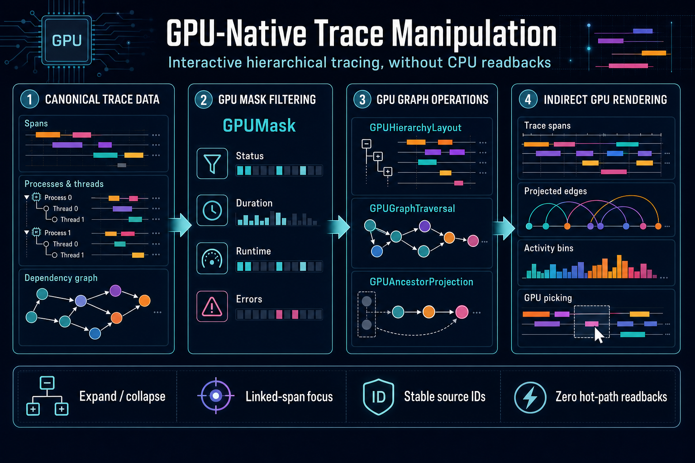

import {GPUPrimitivesDocsTabs} from '@site/src/components/docs/gpu-primitives-docs-tabs';
import {GPUDataAnalysisExample, GPUFrustumCullingExample, GPUTraceViewerExample} from '@site/src/examples';

# GPU Primitives and Command Graphs

<GPUPrimitivesDocsTabs active="overview" />

<p className="badges">
  
  
  
</p>

## Overview

This guide proposes a direction for luma.gl 10 and documents the first working proof of that
direction. The central idea is simple: luma.gl can have more lasting impact by exposing reusable
GPU building blocks than by accumulating isolated visual effects. A bloom implementation, a
particular material, or one culling demo may be useful, but the mechanisms underneath those
features—parallel scans, compaction, indirect commands, explicit resource scheduling, and
GPU-resident tables—can support entire families of applications.

Scientific visualization, trace viewers, geospatial rendering, large scatterplots, text layout,
particle systems, and deck.gl layers repeatedly solve variations of the same problems. They decide
which records are active, transform or expand those records, group or sort them, create draw
arguments, render the result, and occasionally read a small answer back. The GPU is excellent at
that work, but applications often assemble it from unrelated helpers that allocate hidden scratch
buffers, submit commands eagerly, or return results only after a CPU synchronization point.

The experimental GPU primitives replace that pattern with an explicit dataflow:

```text
GPU-resident source data
        ↓
visibility or application predicate
        ↓
exclusive scan
        ↓
stable compaction
        ↓
indirect draw arguments
        ↓
pre-recorded render commands
```

## Concepts

A **primitive** is a narrow reusable GPU operation with explicit input, output, ownership, and
encoding contracts. An **algorithm** may compose several compute passes to provide one data
semantic such as scan, compaction, reduction, or sorting. A **workflow** combines primitives around
an application-level outcome such as visibility or picking. `GPUCommandGraph` schedules all of
them by declared resource uses without owning submission or the application's frame loop.

These layers deliberately preserve GPU-resident identity and dataflow. Source rows keep stable IDs,
variable-size results publish a count alongside fixed-capacity storage, and indirect commands let a
later render pass consume that count without a CPU synchronization point.

The implementation consists of `GPUCommandGraph`, typed graph data views, `GPUScan`,
`GPUCompaction`, `GPUMask`, `GPUVisibilityWorkflow`, `GPUHierarchyLayout`, `GPUGraphTraversal`,
`GPUAncestorProjection`, `GPUSort`, `GPUReduction`, `GPUHistogram`, `GPUGridBinning`,
`GPUGridAggregation`, and `DrawCommandBuffer`. The accompanying hierarchical trace viewer applies these primitives to
process and thread collapse, source and topology filtering, dependency focusing, visible-parent
projection, GPU picking, activity histograms, and indirect span and edge rendering over up to
four million spans. The sort and data-analysis examples demonstrate independent composable
buffer-native algorithms.
The implementation is intentionally experimental: it is concrete enough to measure and use, but
small enough that its API can still respond to experience.



<GPUTraceViewerExample embedded />

The GPU frustum-culling example applies the same primitives to a conventional 3D scene. It tests
bounding spheres in compute, stably compacts visible instance IDs, writes the count into an indexed
indirect record, and replays fixed perspective and overhead render bundles from the same GPU-owned
result. Its split view makes the culling decision observable, while its inspector compares runtime
timing with compiled graph allocation statistics. Together, the examples demonstrate that the API
is not specific to trace data or two-dimensional rendering.

<GPUFrustumCullingExample embedded />

The data-analysis example composes extent reduction, histogram counting, histogram-count
reduction, grid binning, and weighted grid sums in one reusable graph. It uploads Arrow columns and
keeps compilation, submission, validation readback, and transient-allocation diagnostics explicit.

<GPUDataAnalysisExample embedded />

## Why primitives instead of effects?

Rendering libraries historically grow outward from visible results. A library adds a shader for a
lighting model, an antialiasing method, a new material, then a post-processing effect. Those
features are easy to demonstrate because each produces an image. They are less reusable than the
lower-level operations that made the image possible.

The same transition happened earlier in graphics APIs. Fifteen years ago, vertex buffers, shader
programs, framebuffers, and instancing stopped being specialized implementation details and became
ordinary tools. Applications could combine them without waiting for a framework to add a named
effect. WebGPU creates a similar opportunity for compute and GPU-driven rendering. Storage
buffers, compute dispatch, indirect commands, and explicit command recording are available, but
they remain awkward to compose into reliable application subsystems.

For visualization, the reusable unit is rarely “a realistic surface.” It is more often one of the
following:

- Reduce millions of values to an extent, histogram, or aggregate.
- Mark records that intersect a viewport or time range.
- Preserve the selected records in their original order.
- Expand variable-length rows into renderable vertices.
- Sort transparent objects, labels, or trace events by a key.
- Generate a bounded set of commands without inspecting each object on the CPU.
- Render stable groups whose contents change but whose pipelines and bindings do not.
- Pick an object while keeping identity aligned with the source table.

These tasks are useful separately and become much more powerful when their resource and execution
contracts agree. A scan should be usable by visibility, string expansion, polygon generation, and
histograms. A compacted ID vector should feed a renderer or another compute algorithm without a
readback. An indirect command buffer should be writable storage and consumable by a render bundle.
A graph should understand all of those uses without owning the application's frame loop.

## Existing foundations

luma.gl already contains most of the raw ingredients.

`@luma.gl/core` exposes a WebGPU-shaped device API with buffers, textures, render pipelines,
compute pipelines, command encoders, render passes, compute passes, and render bundles. It is the
right layer for thin, portable resource wrappers. The experimental work does not replace those
objects. It composes them.

`@luma.gl/engine` adds shader assembly, pipeline caching, uniform management, `Model`, and
`Computation`. `Computation` already plays the role of a compute-oriented model: it assembles WGSL,
merges shader modules, manages bindings, and dispatches through a caller-provided compute pass.
The proof of concept uses `Computation` internally. A future API audit may rename or refine that
concept as `ComputeKernel`, but a rename is not required to evaluate command graphs.

`@luma.gl/tables` defines Arrow-independent GPU data structures. `GPUData` represents one
contiguous buffer range and its memory format. `GPUVector` represents an ordered list of those
ranges. `GPUTable` preserves row and batch structure. These types give graph buffers a common
language for formats, byte ranges, ownership, and logical row counts.

`@luma.gl/gpgpu` contains lazy evaluators and operations such as arithmetic, gathering, selection,
extent calculation, and bitonic argsort. Several current WebGPU handlers create a computation,
open a pass, submit it, and return a materialized result. That behavior is useful as a convenience
API, but it is not sufficient for a larger GPU-resident workflow. The command graph provides the
explicit encoding substrate that future graph-native gpgpu operations can target.

The missing center is orchestration. Before this experiment, luma.gl had no reusable object that
could declare “this pass writes flags as storage; these scan passes consume scratch; this scatter
pass writes visible IDs; the render pass consumes those IDs and the indirect arguments.” Without
that declaration, each feature has to invent allocation, ordering, ownership, and submission rules.

## The abstraction layers

The proposed system distinguishes five levels. Keeping these levels separate prevents a large
collection of unrelated classes that all happen to end in `Pipeline`.

### Resources

Resources are memory or compiled GPU state. `Buffer`, `Texture`, `TextureView`, `RenderPipeline`,
and `ComputePipeline` belong here. A resource has device ownership, creation usage, and a lifetime.

A storage texture is not a separate kind of texture. It is a texture view used through a storage
binding with a declared access mode. Introducing `StorageTexture` as a parallel resource class
would make it harder to use the same texture as a copy destination, sampled texture, or attachment
at different points in a command stream.

Similarly, an indirect draw buffer is still a buffer. `DrawCommandBuffer` is a typed wrapper that
defines record layout and ownership; it does not create a second memory system.

### Kernels

A kernel combines one compute shader, its layout, bindings, and dispatch. Today `Computation`
provides most of this behavior. A kernel is normally one graph node. It should encode into a
caller-provided pass and never decide when the queue is submitted.

The word pipeline remains reserved for compiled GPU pipeline state. Prefix sum and sorting usually
require multiple dispatches, scratch buffers, or recursively generated work. Calling those objects
pipelines would confuse multi-pass algorithms with `GPUComputePipeline`.

### Algorithms

Algorithms provide data semantics across one or more kernels. `GPUScan` promises exclusive or
inclusive prefix sums, with optional segment starts. `GPUCompaction` promises stable selection. `GPUMask` promises canonical boolean
composition over source-aligned masks. `GPUGraphTraversal` promises bounded, cycle-safe
reachability over stable compressed sparse adjacency. `GPUAncestorProjection` promises bounded
nearest-visible canonical parent resolution. `GPUHierarchyLayout` promises stable scan-based
parent/child row offsets. `GPUSort` promises stable paired `uint32`
ordering while choosing bitonic sort for smaller vectors and radix sort for larger ones.
`GPUReduction`, `GPUHistogram`, `GPUGridBinning`, and `GPUGridAggregation` promise aggregate and
binning results while selecting hierarchical and atomic implementations internally.

The first algorithms are deliberately typed and curated. Arbitrary WGSL callbacks for compare,
combine, and predicate functions are attractive, but they significantly expand validation,
layout, shader-assembly, and portability concerns. Concrete `uint32` semantics let the project
measure the graph model before designing a shader-extension protocol.

### Workflows

Visibility and picking are workflows. They combine application-specific predicates, generic
algorithms, render targets, and identity conventions. They should be expressed as reusable graph
fragments rather than monolithic shaders.

A visibility workflow may use a frustum predicate in a 3D scene, a time/lane predicate in a trace
viewer, or a value-domain predicate in a chart. Each can write the same `0`/`1` flags and reuse the
same scan and compaction implementation. A picking workflow may render stable IDs, reduce a cursor
region, or traverse a spatial index. The identity and readback policies differ even when the
underlying graph machinery is shared.

### Scheduling

`GPUCommandGraph` is the scheduling layer. It understands logical resources and their uses,
derives dependencies, compiles transient lifetimes, creates node-owned GPU objects, and records
work into an encoder. It does not own the animation loop, call `requestAnimationFrame`, submit the
queue, or decide when an application reads data back.

The name “command graph” is intentional. “Render graph” suggests that rendering is the primary
activity with compute as a helper. Visualization workloads frequently run compute without a
canvas, mix several compute stages before one render pass, or produce data for a later frame. The
graph schedules render, compute, and copy commands equally.

## Design principles

The proof of concept follows a small constitution. These rules matter more than the exact method
names because they determine whether independently developed primitives remain composable.

### Encoding is explicit

A compiled graph records into a `CommandEncoder` supplied by the caller. Calling `encode()` does
not submit the device. The application can record uploads, graph work, unrelated render passes,
and readback copies into the same ordered command stream, then submit once.

This rule also makes graphs usable inside deck.gl, an application-owned animation loop, a worker,
or a compute-only service. The graph is a command producer rather than a scheduler for JavaScript.

### Readback is explicit

No algorithm reads its output merely to discover how much work it produced. `GPUCompaction`
writes a GPU count. The trace viewer points that count directly at the `instanceCount` word of an
indirect draw record. Rendering proceeds without the CPU observing the count.

Applications may still read results. The trace viewer samples indirect counts at low frequency to
populate its inspector, but that diagnostic readback does not affect rendering. This distinction
is important: readback is an optional consumer, not a hidden step in the algorithm.

### Ownership is visible

Imported resources are caller-owned. The compiled graph validates and borrows them. Destroying the
graph never destroys an import.

Transient resources are graph-owned. They exist because a node declared scratch storage and are
destroyed with the compiled graph. Node compilation may create computations, shaders, or pipeline
state; those objects are also released by the graph.

`DrawCommandBuffer` can own or borrow its backing buffer. `GPUData` views returned for individual
count fields always borrow it. These rules avoid aggregate objects accidentally destroying storage
that remains in use elsewhere.

### Capacity is structural

The graph compiles against byte lengths and logical row counts. Exceeding an imported descriptor
is an error. The graph never silently reallocates or rebuilds itself during `encode()`.

This policy is more predictable for latency-sensitive applications. A trace viewer can choose a
four-million-span capacity while loading data, compile once, and know that panning will not trigger
allocation. A streaming application can monitor capacity and explicitly replace the graph at a
safe boundary.

The example exposes 250K, 1M, and 4M capacities. Changing the selection intentionally destroys and
rebuilds GPU resources, the render bundle, and the compiled graph. The inspector reports the
compile count and time so the structural event is visible.

### Uses are declared

Each node declares how it uses every graph buffer: storage read, storage write, storage read/write,
uniform, copy source, copy destination, vertex, index, or indirect. The compiler checks that the
logical resource descriptor includes the corresponding `Buffer` usage flag.

Declarations serve three purposes. They document a node's contract, establish dependencies, and
define the lifetimes used for transient reuse. An opaque callback without resource declarations
could record commands, but the graph could not safely reason about it.

### Fail early

Wrong-device imports, missing usage flags, undersized buffers, invalid view ranges, duplicate IDs,
missing dependencies, and cycles fail during graph construction or compilation. Per-encoding
overrides are revalidated before commands are recorded.

WebGPU itself performs extensive validation, but graph-level errors can use application names and
logical capacities. “Buffer `network-visible-ids` is smaller than compiled capacity” is more useful
than a backend binding error emitted after several passes were recorded.

## Logical buffers and typed views

A `GraphBufferHandle` describes a complete logical allocation. It has an ID, a required byte
length, a union of buffer usage flags, and an imported or transient lifetime. It is opaque: users
do not construct handles directly.

A `GraphDataView<T>` describes a typed range within a handle. Its format uses
`GPUVectorFormat`, and it records logical length, byte offset, byte stride, and row byte length.
Views let algorithms bind a subrange without losing table-oriented metadata.

```ts
const graph = new GPUCommandGraph(device, {id: 'filter-and-draw'});

const sourceBuffer = graph.importBuffer(
  {
    id: 'source-ids',
    byteLength: source.byteLength,
    usage: source.usage
  },
  source
);

const sourceIds = graph.createDataView(sourceBuffer, {
  format: 'uint32',
  length: objectCount
});
```

`importGPUData()` preserves one `GPUData` range. `importGPUVector()` preserves every fixed-width
chunk as an ordered `GraphVectorView`. The graph does not choose an execution policy for that
collection: algorithms consume individual `GraphDataView` chunks unless they explicitly document
vector-aware semantics. Interleaved and variable-length vectors require dedicated adapters.

Formats and shader value types remain distinct. `GPUVectorFormat` describes stored bytes such as
`uint32`, `float32x3`, or `unorm8x4`. WGSL declarations describe values such as `u32` and
`vec3<f32>`. Algorithms validate the exact memory forms they support. The initial scan and
compaction require packed, aligned `uint32` values.

## Nodes and dependency compilation

The graph exposes compute, render, and copy nodes. Every node has a stable ID, declared resources,
optional explicit dependencies, and a compile callback. Compilation creates an executable callback
and may allocate node-owned resources such as `Computation` instances.

Dependencies are inferred in insertion order:

- A read depends on the most recent writer of that logical buffer.
- A write depends on the most recent writer.
- A write also depends on readers since the most recent write.
- A read/write use participates in both rules.

These are read-after-write, write-after-write, and write-after-read hazards. Explicit `dependsOn`
edges cover ordering that is not represented by a shared graph buffer. The compiler combines both
sets, rejects missing IDs and cycles, then produces a stable topological order.

Insertion order has semantic meaning when the same logical buffer is written more than once. The
graph is not a functional SSA system in this proof. A later version could introduce resource
versions, but ordinary command recording already uses ordered mutation, and preserving that model
keeps the first API close to WebGPU.

During encoding, the graph opens and closes compute and render passes around their nodes. It applies
node IDs as debug labels and debug groups. Copy nodes operate directly on the command encoder.
Future compilers may merge adjacent compatible compute passes, but pass merging is an optimization,
not a semantic guarantee.

## Transient lifetime reuse

Multi-stage algorithms can allocate much more logical scratch memory than they need at one moment.
A hierarchical scan produces block sums and block offsets at several levels. Three independent
draw groups may run the same chain sequentially. Allocating a unique physical buffer for every
logical scratch range is simple but wasteful.

The graph computes the first and last compiled node that uses each transient. Logical buffers with
non-overlapping lifetimes can share a physical allocation. For each shared allocation, the compiler
uses the maximum required byte length and the union of compatible GPU usage flags.

The current allocator is deliberately understandable. It performs interval reuse for non-mappable
buffers and chooses a compatible free allocation. It does not suballocate byte ranges, alias
textures, or optimize for memory heaps exposed by native APIs. WebGPU does not expose explicit
memory heaps, so “aliasing” at this layer means reusing one WebGPU buffer object for logical
resources whose contents are never simultaneously live.

`CompiledGPUCommandGraph.stats` reports both views:

- Logical transient buffer count and total bytes.
- Physical transient allocation count and total bytes.
- Bytes saved and reuse percentage.
- Final node order.

The trace viewer displays these values. They turn an otherwise invisible compiler behavior into a
property developers can inspect and debate.

## Prefix scan

Prefix sum, commonly called scan, is the central primitive for converting per-record decisions into
addresses. Given values `[1, 0, 1, 1]`, an exclusive sum produces `[0, 1, 1, 2]`. Each selected
record can use its scanned value as a unique output offset.

`GPUScan` implements hierarchical exclusive and inclusive sums over packed `uint32` data. Optional
nonzero segment flags restart either prefix convention. Each workgroup scans 256 values in
workgroup memory. The last aggregate from each block is written to a block-summary buffer. If there
is more than one block, the algorithm recursively scans those summaries. Offset passes then
propagate scanned block totals back down the hierarchy.

The algorithm accepts arbitrary lengths. Partial final workgroups load zero for out-of-range lanes
and avoid out-of-range output writes. Non-power-of-two input lengths therefore do not need caller
padding. Very large inputs create more hierarchy levels but keep the same public contract.

```ts
new GPUScan({
  id: 'visible-prefixes',
  input: visibilityFlags,
  output: visibilityOffsets
}).addToGraph(graph);
```

An inclusive segmented scan adds `mode: 'inclusive'` and a `segmentFlags` view. Segment flags use
the same atomic or vector topology as the input. The first logical row begins a segment; every
later nonzero flag starts another. A segment may cross vector chunk boundaries, so chunking remains
storage metadata rather than changing data semantics.

Scratch block sums and offsets are graph transients. They participate in lifetime analysis and are
released with the compiled graph. `GPUScan` does not allocate during encoding.

For matching `GraphVectorView` input and output, scan treats all chunks as one logical sequence
while keeping every caller-visible buffer and chunk boundary intact. It scans chunks locally,
scans their totals, and explicitly propagates the resulting carries across chunk boundaries.

All variants wrap modulo 2^32. Signed or floating-point sums, minimum/maximum operators, and
user-defined associative operators remain deferred until they have explicit numerical and
determinism contracts.

## Stable compaction

Compaction takes values and `0`/`1` selection flags and writes only selected values to a dense
output. “Stable” means survivors retain source order. Stable identity is important for tables,
trace viewers, picking, and deterministic rendering.

`GPUCompaction` composes `GPUScan` rather than implementing a separate addressing scheme:

1. Exclusively scan the flags into offsets.
2. For each flag equal to one, scatter its value to `output[offset]`.
3. Let the final invocation write `lastOffset + lastFlag` as the result count.

```ts
new GPUCompaction({
  id: 'visible-objects',
  input: sourceIds,
  flags: visibilityFlags,
  output: visibleIds,
  count: visibleCount
}).addToGraph(graph);
```

The current operation compacts packed `uint32` values. This is enough for the most important
indirection pattern: compact stable source row IDs, then let a renderer or subsequent kernel fetch
the full records. Compacting IDs also avoids copying wide records when visibility changes.

The count is an ordinary one-element graph view. It can target a standalone buffer, a field in a
larger parameter structure, or the `instanceCount` word inside an indirect command. Zero-length
inputs add a tiny count-clearing pass and never dispatch a zero-sized scan.

For matching vector input, flags, and output, compaction uses vector-wide scan offsets and fills the
existing output chunks as one logical sequence. It does not concatenate, repack, or replace caller
buffers, and the count remains a single total for the complete vector.

## Composable visibility masks

Interactive applications rarely have one visibility predicate. A trace viewer may combine its
time range, process expansion, thread expansion, duration threshold, selected statuses, runtime
classification, and dependency-focused neighborhood. Each predicate can write a source-aligned
packed `uint32` mask; `GPUMask` combines those decisions into one renderer-facing result.

```ts
new GPUMask({
  id: 'focused-visible-spans',
  inputs: [viewportMask, hierarchyMask, focusedSpanMask],
  output: visibleSpanMask,
  operation: 'and'
}).addToGraph(graph);
```

`'and'`, `'or'`, `'xor'`, `'difference'`, and `'not'` use zero/nonzero semantics and always
produce canonical zero or one. Matching `GraphVectorView` masks retain their original ordered
chunks. Composition does not repack source data, submit commands, or read back results.

## Bounded graph traversal

Topology-based selection uses `GPUGraphTraversal`. It accepts forward and optional reverse
compressed sparse adjacency and publishes one node-aligned reachability mask.

```ts
new GPUGraphTraversal({
  id: 'selected-dependency-neighborhood',
  offsets: outgoingOffsets,
  neighbors: outgoingNeighbors,
  reverseOffsets: incomingOffsets,
  reverseNeighbors: incomingNeighbors,
  seeds: selectedSpanIds,
  seedCount: activeSeedCount,
  output: reachedSpanMask,
  direction: 'both',
  maxDepth: 4,
  activeDepth: requestedDepth
}).addToGraph(graph);
```

Frontiers are graph-owned transients. Atomic node claims ensure that cycles, duplicate edges, and
shared descendants cannot repeatedly publish the same node. GPU-resident seed counts and active
depth change the focused neighborhood without rebuilding the fixed-capacity graph.

## Hierarchy-aware layout

Expansion changes both visibility and row position. `GPUHierarchyLayout` first converts parent
and child expansion flags into effective child heights, then composes `GPUScan` to produce stable
exclusive offsets.

```ts
new GPUHierarchyLayout({
  id: 'process-thread-layout',
  parentStates: processStates,
  childStates: threadStates,
  heights: threadHeights,
  offsets: threadOffsets,
  childrenPerParent: 4,
  expandedChildHeight: 4,
  collapsedChildHeight: 1,
  collapsedParentHeight: 1
}).addToGraph(graph);
```

A collapsed parent contributes one summary row; its remaining children contribute zero. Expanded
parents retain child-specific full or collapsed heights. A renderer fetches the resulting offsets
directly from storage, so expand/collapse modifies no source records or render bundle.

## Visible parent projection

Filtering an intermediate parent must not sever the visual dependency between its surviving
ancestor and descendant. `GPUAncestorProjection` resolves every canonical node to the closest
currently visible source row without rewriting original edge data.

```ts
new GPUAncestorProjection({
  id: 'visible-dependency-endpoints',
  parents: canonicalParentIds,
  visibility: visibleSpanMask,
  output: nearestVisibleAncestors,
  maxDepth: 32
}).addToGraph(graph);
```

Visible nodes project to themselves. Missing parents, cycles, and chains beyond `maxDepth`
produce a caller-configurable invalid sentinel. Edge shaders can then redirect hidden endpoints
to visible ancestors while retaining stable original dependency IDs.

## Indirect drawing and stable draw groups

WebGPU exposes `drawIndirect()` and `drawIndexedIndirect()`. Each call reads one fixed record from a
buffer. It does not currently expose an indirect-count multi-draw operation that lets a shader
generate an arbitrary number of new draw calls. This constraint shapes an honest GPU scene model.

The CPU defines stable draw groups: pipeline, geometry, bindings, and a bounded command slot. The
GPU controls which object IDs appear in each group and how many instances the command draws. A
render bundle can record the stable binding and indirect draw sequence once, while compute changes
buffer contents every frame.

`DrawCommandBuffer` supports both standard layouts:

```text
draw:         vertexCount, instanceCount, firstVertex, firstInstance
drawIndexed:  indexCount, instanceCount, firstIndex, baseVertex, firstInstance
```

The wrapper creates storage/indirect/copy-capable buffers, validates borrowed buffers, exposes byte
offsets, and records the correct render-pass method. `getInstanceCountData()` returns a borrowed
`GPUData<'uint32'>` over one record field.

The trace viewer imports the whole command buffer once, then creates one graph view at each
`instanceCount` offset. Each group compaction writes directly to its view. The final render node
declares the same logical buffer with indirect usage, so the graph infers the write-to-draw
dependency.

This model is GPU-driven without pretending WebGPU is bindless. The CPU no longer visits individual
objects, but it still owns pipeline and binding topology. Future APIs such as `GPUScene` should be
designed as draw databases over stable groups rather than general-purpose hierarchical scene
graphs.

## The trace-viewer graph

The example synthesizes stable compute, network, and storage span ranges. Each 32-byte canonical
span stores start time, duration, lane, group, process, thread, source identity, and numeric
classification flags. Fixed-width dependency records preserve source and destination span IDs.
Forward and reverse CSR indexes support dependency selection without string parsing or per-frame
CPU adjacency construction.

At the start of each encoding, process and thread expansion buffers determine thread heights.
`GPUScan` converts those heights into packed lane offsets. Collapsing a process hides its
individual spans, recomputes following row positions, and exposes a GPU-binned activity summary.
Collapsing a thread retains one representative row without changing any source identity.

For each span group, the graph performs:

```text
hierarchical visibility
  reads: canonical spans, process state, thread offsets, filters, view uniforms
  writes: base flags, source IDs, optional picked source ID

focused mask composition
  reads: base flags, dependency-reachability mask
  writes: final visible flags

scan block passes
  reads: flags or block sums
  writes: offsets and block sums

scan offset passes
  reads: block offsets
  updates: offsets

compaction scatter
  reads: source IDs, flags, offsets
  writes: visible IDs, indirect instance count
```

After all three span groups, dependency visibility tests canonical edge endpoints against the
final span masks and collapsed-process ownership. A separate stable compaction writes the edge
instance count directly to a fourth indirect draw. A fifth pre-recorded draw consumes collapsed
process activity bins.

The span vertex shader uses `instance_index` to fetch its stable compacted source record and
resolves the current Y position from GPU-scanned thread offsets. Dependency shaders retain
original edge IDs and route collapsed endpoints to their summary rows.

Canvas picking reuses the visibility dispatch: a pointer request uploads one time and lane, and
matching visible spans atomically publish a canonical source ID. Only an explicit click reads
that single result. An ordinary frame does not depend on picking or count readback.

Panning, zooming, group and status filters, duration thresholds, process and thread expansion,
dependency visibility, selected seeds, and focus depth update small interaction buffers or
uniforms. The source allocation, compiled graph, and five-command render bundle remain stable.
The inspector periodically reads indirect counts for telemetry without gating rendering.

## A frame from construction to presentation

It is useful to separate work that happens when an application chooses a capacity from work that
happens for every frame. The distinction is not merely an optimization. It is part of the API's
predictability contract.

During construction, the application allocates its durable source buffers, visibility flags,
visible-ID outputs, uniform storage, and indirect command records. It then declares the graph's
logical imports. Imported descriptors state the minimum byte length and complete set of uses that
the executable may require. The descriptor is a promise made by any buffer supplied later; it is
not just a description of the current default buffer.

Algorithms add their own nodes and scratch declarations. At this point no GPU commands have been
recorded. `GPUScan` can calculate how many hierarchical levels a capacity needs and declare all
block sums and offsets. `GPUCompaction` can add its scatter operation and result count. The
application adds the render node after the computations that produce its inputs.

Compilation performs four conceptually separate jobs. First, it validates the closed graph:
identifiers resolve, declared uses are legal for their logical resources, and explicit dependency
edges exist. Second, it derives hazard edges and creates the stable node order. Third, it computes
transient intervals and creates physical scratch allocations. Fourth, it invokes each node's
compile callback so shaders, bind-group layouts, models, or other persistent executable state can
be prepared. If node compilation fails, already-created node state and graph allocations are
destroyed before the error is returned.

The application may also record a render bundle at construction time. In the trace viewer, the
bundle captures three groups. Each group binds a different compacted-ID vector and color, then
records one indirect draw at a fixed byte offset. The bundle refers to buffers, not snapshots of
their contents. Updating IDs or instance counts therefore changes what a later execution draws
without re-recording the bundle.

At frame time the CPU writes only the changing inputs. For the trace viewer these are the visible
time origin, time scale, viewport size, enabled-group mask, and lane layout. A streaming consumer
might also write newly arrived table chunks or a small range of dirty records. Those writes remain
application operations and are not disguised as graph behavior.

The caller creates or obtains a command encoder and calls `compiledGraph.encode()`. Import
overrides are resolved at that moment, which is why a `DynamicBuffer` can replace its backing
buffer between frames. The graph validates the current backing allocation before opening a pass.
Each compute node gets a distinct compute pass in this proof. Copy nodes record directly, and the
render node opens the framebuffer pass and executes the bundle. Debug groups mirror node IDs.

After encoding returns, the command encoder still belongs to the caller. The application can add a
timestamp resolve, copy three count words to a staging buffer, run a UI pass, or record commands
for another subsystem. Only then does it finish and submit. This makes queue ownership obvious and
allows one submission to establish ordering across graph and non-graph work.

Presentation is not a graph operation. The device or animation framework presents the canvas as it
normally would. Likewise, a diagnostic readback completes through the application's ordinary
asynchronous buffer API. The graph does not stall the frame to make its inspector exact.

When capacity changes, the structural lifecycle repeats. The application first stops encoding with
the old executable, destroys the render bundle and compiled graph, allocates replacements, and
compiles a new graph. An application may prepare a replacement before retiring the old one if it
needs seamless switching, but it must own that double-buffering policy explicitly.

## Hazard reasoning in practice

Hazard names can sound abstract, so consider one logical flag buffer. A visibility node declares
`storage-write`; a scan node declares `storage-read`. The scan has a read-after-write hazard and
must follow visibility. If a later clear node overwrites the flags, it has both a write-after-write
relationship with visibility and a write-after-read relationship with scan. Moving the clear
before scan would destroy data that scan still needs.

The compiler tracks the most recent writer and readers since that writer for each logical handle.
A read depends on the writer. A write depends on the writer and all active readers, then becomes
the new writer. This is enough for mutable, insertion-ordered command streams without inventing
implicit versions of every resource.

The word *logical* is essential. Two views of the same handle participate in the same hazard chain,
even when their byte ranges do not overlap. This is conservative. It prevents the scheduler from
making a false independence claim when an application creates overlapping or strided views. A
future compiler may track proven-disjoint byte intervals, but that requires range semantics for
every node and brings diminishing returns for the first implementation.

Conversely, two separately imported handles that happen to reference the same physical buffer are
not automatically recognized as aliases. Applications should import a physical allocation once
and create views from that handle when ordering matters. The trace viewer follows this rule for
the indirect command buffer: three count views and the final indirect read all derive from one
logical import.

Explicit dependencies are appropriate when order is not represented by a buffer. Examples include
timestamp conventions, external attachment state, a node that mutates backend state hidden inside
a model, or a deliberate phase boundary used for debugging. They should not be sprinkled onto
ordinary dataflow. Declared resources make the graph self-documenting and allow allocation
analysis; arbitrary edges do not.

Stable topological ordering makes graph output reproducible. If several nodes are ready, their
original insertion order wins. Successive writers therefore retain the order in which the builder
added them. Reproducibility matters for GPU captures, generated documentation, tests, and numerical
algorithms whose floating-point result can vary with association.

Pass boundaries are currently part of the compiled output. One compute node means one compute
pass. This is easy to label and reason about but may not be optimal on every implementation. Later,
the compiler can merge adjacent compute nodes when their semantics allow it. Such a change must
preserve debug visibility and must never reorder a hazard. Applications should rely on node order,
not on the number of backend pass objects.

## Memory planning and pressure

Transient reuse addresses a specific source of memory pressure: algorithms that need temporary
results during a bounded interval. It does not make all GPU memory virtual. Imported source data,
render outputs, command records, and results that survive the graph remain durable allocations
owned by their callers.

For a hierarchical scan, the first level over four million values produces about fifteen thousand
block sums. Scanning those values produces another small level. Offset propagation later consumes
the stored levels in reverse. Across three independent draw groups, the logical graph contains
many named scratch vectors, but not all are live together. Interval reuse lets later group scratch
occupy a buffer released by an earlier group while preserving distinct logical names in errors and
the inspector.

Physical compatibility includes capacity and usage. A reused buffer must be at least as large as
every logical tenant, and it is created with the union of required non-mapping uses. The proof uses
whole-buffer reuse rather than byte suballocation. Whole-buffer reuse leaves some slack when a
large allocation later hosts a small vector, but it keeps offsets simple and avoids turning the
graph into a custom heap allocator before measurements justify one.

Logical and physical byte totals answer different questions. Logical bytes communicate algorithmic
scratch demand: how much temporary storage would be allocated if every declaration received a
dedicated object. Physical bytes approximate the actual WebGPU buffer storage retained by the
compiled graph. Their difference is reported as reused bytes and percentage. A high percentage is
not automatically good if it requires one oversized allocation, and a low percentage is not a
failure if most data is simultaneously live. The metrics are diagnostic facts, not a score.

Fixed capacity makes memory planning meaningful. If a graph silently grew an output during
encoding, compiled lifetimes and physical totals would become stale. A replacement could also
invalidate render-bundle references and bindings. Explicit rebuilding turns that potentially
surprising event into an observable application transition.

Memory budgets should therefore be chosen from product behavior. Interactive datasets with known
upper bounds can compile to that bound. Streaming systems can use pages or batches and run the same
compiled graph per page. Systems with rare growth can keep geometric capacity tiers and rebuild at
controlled points. The trace viewer's three capacity choices illustrate tiers, not a universal
growth strategy.

The graph owns destruction for transients exactly once, at the physical-allocation level. Logical
handles that share an allocation do not each destroy it. Imported buffers remain alive after
`CompiledGPUCommandGraph.destroy()`, and node-owned models or computations are released through
their executable callbacks. Idempotent destruction allows cleanup code to remain simple when
construction partially fails or a UI tears down twice.

## Table-oriented integration patterns

The dependency on `@luma.gl/tables` is architectural. Visualization inputs are usually columns or
record batches, not anonymous byte arrays. A graph that discards logical lengths and formats at its
boundary forces every algorithm and renderer to reconstruct that information independently.

`GPUData` is the closest adapter because it denotes one contiguous range. Importing it creates a
logical handle for the complete backing buffer and a typed graph view for the data range. Ownership
does not transfer. Byte offset, stride, row payload size, format, and length remain visible. This
supports a packed scalar vector, a column inside a larger allocation, or a borrowed field such as
an indirect command's count word.

An offset view reveals a subtle WebGPU concern. Storage bind-group offsets have a device alignment
requirement that is commonly 256 bytes, while a typed `uint32` field is only four-byte aligned. The
algorithms therefore bind the aligned containing range and add a compile-time element offset in
WGSL. This is how compaction can legally write the `instanceCount` at byte offset four without a
copy pass. The graph view continues to describe the precise four-byte field; binding adaptation
belongs to the kernel that knows its storage layout.

`GPUVector` adds chunking. Importing a fixed-width vector returns a `GraphVectorView` containing one
`GraphDataView` per source chunk. The graph preserves chunk order and shared physical allocations;
it does not concatenate, copy, or dispatch work automatically. Algorithms still declare atomic
`GraphDataView` resources, so accepting a `GraphVectorView` is an explicit algorithm-level choice.
Interleaved and variable-length vectors remain rejected until dedicated adapters define attribute
and topology semantics.

A batch-aware graph API can offer explicit choices. A map-style algorithm may instantiate a
graph fragment for every chunk. A streaming scan may produce a per-chunk total, scan those totals,
then add carries. An application that truly needs contiguous storage can call a named packing
operation and account for its allocation. All three are useful, and none should be selected merely
because an adapter received a multi-chunk vector.

`GPUVectorFormat` describes stored bytes. It deliberately does not claim that every memory format
can be bound to every shader declaration. A normalized `unorm8x4` column occupies four bytes but
may appear to a vertex shader as `vec4<f32>`. A packed `float32x3` occupies twelve bytes, while a
corresponding structure member in a WGSL storage layout may require sixteen-byte alignment. Graph
views preserve memory truth; kernels and model adapters validate shader compatibility at the
boundary where usage is known.

Variable-length formats such as `vertex-list<float32x3>` need topology metadata and expansion
policy. A generic graph view can carry the format string and flattened value count, but a renderer
cannot treat its logical rows as fixed-stride vertices. Future graph-native path or polygon
workflows should consume offsets explicitly, use scan to allocate expanded output, and expose the
result as a fixed renderable vector.

`GPUTable` integration should preserve record-batch boundaries for streaming. A table-oriented
workflow can declare required columns, validate equal row counts, and build one graph invocation
per batch or a graph with explicit batch descriptors. This is where the tables package graduating
into engine in v10 becomes valuable: core orchestration and core GPU data containers can share
types without Arrow becoming a transitive dependency.

Arrow remains an adapter layer. Upload helpers can map Arrow primitive, list, dictionary, and
validity representations into table objects. Readback helpers can reconstruct Arrow arrays when an
application asks. Neither graph compilation nor scan should import Apache Arrow or use Arrow data
types as its primary GPU metadata.

## Operational guidance for graph authors

Graph fragments should have narrow, inspectable contracts. Accept views and configuration, add
named nodes, and return output views or handles that callers can compose. Avoid hiding imports,
submissions, or readbacks inside a helper. A fragment that needs scratch should declare transients
with IDs derived from its own stable ID so captures remain understandable when several instances
exist.

Declare every use, including uses that do not appear as shader bindings. An indirect command read,
vertex fetch, index fetch, copy source, and copy destination all affect order and required creation
flags. A render node that binds visible IDs as storage and draws from a command buffer should list
both. Omitting the command buffer might render correctly by accident in a fixed insertion order,
but it removes the dataflow edge and makes later graph changes unsafe.

Prefer compact IDs over compact wide records. IDs are inexpensive to scan and scatter, preserve a
stable identity space, and let multiple consumers fetch only the columns they need. They also keep
picking results aligned with source tables. Compacting full records is appropriate when downstream
access would otherwise be badly scattered, but that should be an explicit transformation with a
declared output schema.

Keep result counts GPU-resident when they control GPU work. An indirect instance count, a dispatch
argument, or a later algorithm bound should flow through storage or indirect buffers. Read it only
for application decisions that genuinely belong on the CPU. A telemetry panel is not a reason to
put a readback into the render dependency chain.

Treat limits and overflow as API behavior. A `uint32` scan wraps modulo 2^32. A compaction output
must have at least the input's logical capacity even if typical visibility is low, unless the API
defines overflow handling. Dispatch dimensions must respect device limits. More advanced
algorithms may need tiled dispatch or 64-bit emulation; the proof keeps its supported domain
explicit rather than promising unbounded work.

Use debug names as part of design, not as decoration added after a failure. Node IDs should describe
the domain and operation, such as `network-visibility` or `storage-compaction-scan-level-1`. Buffer
IDs should describe content rather than implementation variables. These names appear in validation
messages, browser diagnostics, captures, and the graph inspector.

Graph authors should also consider where parameter specialization belongs. Capacity is compiled
into scan and compaction shaders in this proof, which removes a uniform read from hot kernels and
makes bounds obvious. View origin, zoom, and group enablement change every frame and belong in a
uniform buffer. Specializing a frequently changing value would force expensive recompilation;
turning every structural constant into a uniform would weaken validation and optimization.

Finally, keep a CPU oracle in tests even when production has no CPU fallback. A deterministic CPU
scan or filter is ideal for verifying GPU results across boundary sizes and random masks. The
oracle does not weaken the WebGPU-only product posture; it supplies a precise test expectation.
End-to-end tests should additionally verify that changing a GPU-written indirect count changes
rendering without a CPU-side draw branch.

## Choosing names that can survive v10

Names should expose the durable concept rather than the current shader technique. `GPUScan`
describes an algorithmic result. `PrefixSumPipeline` would collide with WebGPU pipeline
terminology and imply that one pipeline object performs the full hierarchy. `GPUCompaction`
describes stable selection and leaves room for different kernels.

`DrawCommandBuffer` names a typed resource wrapper. `IndirectDrawBuffer` is understandable, but it
can suggest that the buffer supports only consumption. In practice the important property is that
compute can write well-defined command records that render passes consume indirectly. The wrapper
therefore exposes record layout, count views, and encoding helpers together.

`GPUCommandGraph` is broader than `RenderGraph`. Scientific workflows may never open a render pass,
and a trace viewer performs most of its work in compute. The word command also reinforces that the
output is encoding into a caller's command stream rather than an automatically submitted frame.

Terms such as `VisibilityPipeline` and `PickingPipeline` are better treated as workflows unless a
specific object truly wraps one compiled backend pipeline. Visibility combines a domain predicate,
scan, compaction, counts, and sometimes level-of-detail selection. Picking combines identity
rendering, region selection, reduction, and explicit readback. Workflow objects can assemble graph
fragments while reusing the underlying algorithms.

Likewise, `GPUAccelerationStructure` is too broad for today's WebGPU. It can be confused with
native ray-tracing objects that the web API does not expose. Concrete names such as `GPUGridIndex`,
`GPUBVH`, or `GPUIntervalIndex` reveal the data structure, construction cost, and queries an
application can expect. Their buffers and build/traversal algorithms can still compose through the
same graph.

This naming discipline is meant to keep public types small. luma.gl does not need one class for
every impressive demo. It needs a vocabulary in which resources, kernels, algorithms, workflows,
and scheduling have distinct meanings and can evolve independently.

## Error handling and debugging

The experimental API favors named, early errors:

- A graph constructed with a non-WebGPU device is rejected.
- Buffer and node IDs must be unique.
- Descriptors require safe non-negative byte lengths and nonzero usage.
- Views must fit inside their logical buffers.
- Algorithm views must be packed and aligned in the supported format.
- Per-encoding overrides must match the compiled capacity and usage.
- Imports from another device are rejected by resource consumers and core indirect validation.
- Explicit dependencies must name existing nodes.
- Cycles fail compilation.
- A graph cannot be mutated or compiled again after compilation.
- A destroyed executable cannot encode.

Node IDs become compute/render pass labels and nested debug groups, making browser GPU captures
match graph documentation. The next instrumentation step is optional timestamp allocation per
node. Timestamp support should remain capability-gated and should not force readback during normal
encoding.

## Backend policy

These APIs require WebGPU. They do not emulate compute with transform feedback or textures on
WebGL2. Existing luma.gl rendering and table APIs continue to support WebGL where appropriate, but
the advanced tier is allowed to expose capabilities that only make sense in WebGPU.

This separation avoids a lowest-common-denominator graph. WebGL command execution is effectively
immediate, has no compute pass, and cannot consume WebGPU indirect records. A portable facade would
need CPU mediation exactly where the architecture is trying to preserve GPU residency.

Applications should feature-detect WebGPU and choose a separate product fallback when necessary.
Individual high-level workflows may provide CPU or WebGL implementations, but those fallbacks are
not part of `GPUCommandGraph` semantics.

## Package evolution

The proof lives in `@luma.gl/experimental` so graph contracts, naming, allocation behavior, and
algorithm ergonomics can change together. It depends on `@luma.gl/tables` because typed GPU ranges
are central to the design, not an optional adapter.

The intended v10 layering is:

```text
@luma.gl/engine
  table-independent command-graph scheduling core
  buffer, texture, pass, and generic graph views
  compute/render kernel integration without a tables dependency

@luma.gl/tables
  GPUData, GPUVector, GPURecordBatch, GPUTable, GPUSchema, GPUVectorFormat
  GPU table and vector adapters for graph views

@luma.gl/gpgpu
  GPUScan, GPUCompaction, and reusable visibility workflows
  GPUMask, GPUHierarchyLayout, GPUGraphTraversal, GPUAncestorProjection
  GPUReduction, GPUSort, GPUHistogram, GPUGridBinning, GPUGridAggregation
  higher-level table algorithms

@luma.gl/arrow
  Arrow upload, conversion, and readback adapters
```

Generic GPU table types remain owned by `@luma.gl/tables`; moving them into engine would reverse the
current package dependency and create a cycle. A graduated command-graph core must therefore use
only core resource concepts. Table-to-graph adapters stay with tables, while optional algorithms
and workflow builders move to gpgpu. `DrawCommandBuffer` needs the same audit: an engine-level core
cannot import `GPUData`, so its final placement or split remains part of graduation rather than a
predeclared stable contract.

The graph already has three independent consumers. Graduation now requires each candidate stable
abstraction—not only the graph as a whole—to be exercised by at least two consumers. The trace
viewer proves two-dimensional filtering and rendering. The frustum-culling field adds
bounding-sphere visibility, indexed indirect drawing, and a moving three-dimensional camera. The
data-analysis example adds Arrow columns, scientific reduction, histogram composition, and spatial
counts. Later consumers should exercise different patterns such as text expansion or path
tessellation.

## Phased roadmap

The command-graph foundation and first hierarchical-trace, analysis, texture, and picking
milestones are implemented. The remaining work is ordered by dependency so that later APIs build
on measured, reusable contracts instead of demo-specific behavior.

Impact estimates how broadly a phase unlocks GPU-driven applications. Complexity/cost estimates
relative engineering scope, integration risk, and validation effort; it is not a staffing or
schedule commitment.

| Phase | Outcome | Status | Impact | Complexity/cost |
| --- | --- | :---: | :---: | :---: |
| 0 — Current foundation | Command graph, masks, hierarchy layout, graph traversal, ancestor projection, compaction, indirect drawing, picking, analysis primitives, and three working consumers | Implemented | High | Complete |
| 1 — Hardening and observability | GPU timestamps, performance baselines, adapter capability reporting, boundary and overflow validation, memory statistics, and device-loss and resource-lifetime coverage | Implemented | High | Medium |
| 2 — Reusable visibility workflows | Renderer-independent time-range, bounds, LOD, and selection workflows that publish stable IDs, counts, and indirect commands | Implemented | High | Medium |
| 3 — Algorithm and table scaling | Multi-chunk coverage, segmented and inclusive scans, weighted aggregation, richer histograms, and batch-preserving algorithms | In progress | High | Large |
| 4 — Picking and texture coverage | Region picking, asynchronous staging rings, multisample resolves, swapchain imports, and external-texture contracts | Planned | Medium | Large |
| 5 — Spatial acceleration | `GPUGridIndex` followed by `GPUBVH`, with explicit build, update, and query costs | Planned | High | Large |
| 6 — GPUScene | A flat GPU draw database with stable identity, bounds, transforms, grouping, geometry references, and indirect command slots | Planned | High | Large |
| 7 — API graduation | Stable package contracts, compatibility exports, and a dependency-safe move out of experimental packages | Planned | High | Large |

### Phase 0 — Current foundation

**Entry dependencies:** None. This is the implemented baseline.

The baseline includes fixed-capacity buffer and logical-texture scheduling across compute, render,
and copy nodes; hazard inference; imported-resource overrides; graph-owned attachments; transient
reuse; ownership validation; and allocation statistics. Implemented algorithms cover exclusive,
inclusive, and segmented scans; stable compaction; chunk-preserving boolean masks; bounded CSR
traversal; nearest-visible parent projection; paired sort; scalar reduction; histogram counting;
spatial grid binning; and GPU-written indirect commands.

`GPUIndexPickingTarget` provides single-pixel integer object and batch picking. The hierarchical
trace viewer adds GPU-scanned process/thread layout, source and topology filtering, dependency
focus, click picking, collapsed activity, projected edges, and stable indirect span and edge groups.
The frustum-culling and GPU data-analysis examples provide two additional consumers.

**Exit criteria:** Achieved by the current exported primitives, reference documentation, CPU
oracles, WebGPU tests, and the three independent examples.

### Phase 1 — Hardening and observability

**Status:** Implemented in the experimental API.

**Entry dependencies:** Phase 0 behavior remains experimental but functionally complete.

Add capability-gated timestamp allocation per graph node without adding readback to normal
encoding. Establish repeatable performance and memory baselines for empty inputs, workgroup
boundaries, maximum example capacities, dense dependency graphs, and repeated parameter-only
updates. Extend adapter diagnostics, capacity and overflow tests, device-loss handling, and
resource-lifetime coverage.

`CompiledGPUCommandGraph.capabilities` reports graph-relevant adapter support and limits. Expanded
`stats` account for imported, logical, and owned transient memory. Every `encode()` returns
synchronous whole-graph and per-node CPU costs; timestamp-enabled encoders additionally support an
explicit post-submit `readTimings()` call. The documented benchmark protocol covers boundary and
maximum example capacities without making readback part of the frame loop.

**Exit criteria:** Achieved by capability reporting, encoding and timestamp diagnostics, expanded
memory statistics, safe-range and adapter-limit validation, device-loss rejection, lifecycle tests,
and the repeatable benchmark protocol.

### Phase 2 — Reusable visibility workflows

**Status:** Implemented in the experimental API.

**Entry dependencies:** Phase 1 establishes measurement, failure, and lifetime contracts.

Standardize graph fragments for bounding spheres, axis-aligned boxes, time ranges, LOD thresholds,
and selection masks. A workflow publishes source-aligned masks, compacted stable IDs, counts, and
optional indirect-command fields rather than a renderer-specific object. Refactor the trace viewer
and frustum-culling example to consume the same workflow contract.

General application-defined WGSL predicates remain deferred until fixed-contract workflows reveal
the necessary shader-extension points.

`GPUVisibilityWorkflow` now accepts source-aligned time-range, bounds, LOD, and selection masks,
intersects them, optionally publishes the canonical mask, generates or consumes stable source IDs,
and writes compacted IDs plus one GPU-resident count. Atomic and multi-chunk vector inputs share
the same contract. The hierarchical trace viewer and frustum-culling example both use the workflow
and send its count directly to indirect rendering; changing view and selection data does not
recompile either graph.

**Exit criteria:** Achieved by two consumers sharing one workflow without application-owned scan or
compaction plumbing, parameter-only interaction updates on compiled graphs, and GPU-resident counts
flowing directly into indirect rendering.

### Phase 3 — Algorithm and table scaling

**Status:** In progress. Inclusive and segmented `uint32` scans plus weighted floating-point grid
aggregation are implemented.

**Entry dependencies:** Phase 2 provides real workflow demand for each added variant.

`GPUScan` now supports inclusive output and nonzero segment-start flags for both atomic data views
and chunk-preserving vectors. Segments continue across chunk boundaries, hierarchical summaries
preserve carry-in values when a later row starts a segment, and all arithmetic retains the
documented modulo-2^32 behavior. The data-analysis example uses inclusive scan for a histogram CDF
and a segmented inclusive scan for per-row spatial-grid prefixes.

`GPUGridAggregation` pairs `float32x2` positions with aligned `float32` weights and accumulates one
row-major floating-point sum per cell. Atomic data views and vectors with identical chunk topology
share the same clear-once contract. Non-finite positions and weights are ignored; atomic
compare-exchange addition makes `float32` rounding explicit without promising a deterministic
cross-invocation accumulation order. The data-analysis example composes weighted sums with counts
over the same imported Arrow batches.

Remaining work extends multi-chunk support to algorithms that still require one packed view, then
adds minimum, maximum, and mean grid aggregates, irregular-edge and categorical histograms, and
batch-aware operations that preserve table structure. Custom associative scans, sparse histograms,
and multidimensional histograms should be added only with a concrete consumer and an explicit
numerical or memory contract.

**Exit criteria:** Each new variant has a deterministic CPU oracle, empty and boundary coverage,
multi-chunk tests where applicable, explicit overflow and floating-point behavior, and at least one
application or renderer consumer.

### Phase 4 — Picking and texture coverage

**Entry dependencies:** Phase 1 defines resource-lifetime and asynchronous readback behavior;
Phase 2 defines stable visible identity.

Expand picking from one pixel to bounded regions and add reusable staging-buffer rings for
asynchronous results. Add graph contracts for multisampled resolve targets, swapchain imports, and
external textures so their subresources, hazards, ownership, and frame lifetimes are explicit.
Callback, highlighting, tooltip, and color-encoded fallback policies remain higher-level workflow
or application concerns.

**Exit criteria:** Region results preserve stable object and batch identity; repeated picks do not
serialize rendering on mapped buffers; and resolve, swapchain, and external resources participate
in graph validation without accidental ownership or cross-frame reuse.

### Phase 5 — Spatial acceleration

**Entry dependencies:** Phase 1 supplies measurement, Phase 2 supplies reusable visibility, and
Phase 3 supplies the required scan, compaction, and batching behavior.

Implement `GPUGridIndex` before `GPUBVH` to validate build, update, storage, and query interfaces on
a simpler structure. Add `GPUBVH` only after grid-index consumers establish the shared contract.
Both are library-built storage-buffer structures, not native WebGPU acceleration resources, and
must expose their construction and query costs.

**Exit criteria:** Both a two-dimensional and a three-dimensional consumer can build or update an
index, query it through a graph, feed results into visibility or picking, and compare correctness
and cost with an unindexed GPU scan.

### Phase 6 — GPUScene

**Entry dependencies:** Phase 2 provides visibility output, Phase 4 provides interaction and
texture resource contracts, and Phase 5 provides spatial queries.

Define `GPUScene` as a flat draw database containing stable object IDs, bounds, transforms, group
membership, geometry references, and indirect command slots. CPU scene graphs may update this
database, and table-oriented applications may construct it directly; `GPUScene` does not introduce
a second game-engine hierarchy.

**Exit criteria:** Incremental updates preserve stable identity, visibility and spatial-query
results write draw commands without CPU draw selection, and both scene-graph and table-oriented
consumers use the same storage contract.

### Phase 7 — API graduation

**Entry dependencies:** Phases 1–6 have stable failure, ownership, extension, and package-boundary
contracts, and every candidate abstraction has at least two independent consumers.

Move the table-independent scheduling core to `@luma.gl/engine`, keep generic GPU table types and
graph adapters in `@luma.gl/tables`, and move optional algorithms and reusable workflows to
`@luma.gl/gpgpu`. Keep Arrow conversion and readback adapters in `@luma.gl/arrow`. Audit
`DrawCommandBuffer` and split its core from table integration if that is required to avoid an engine
dependency on tables. Provide compatibility exports and migration notes for experimental users.

**Exit criteria:** The final package graph has no dependency cycle or Arrow leakage into tables or
gpgpu; compatibility exports cover one deprecation window; public API documentation names ownership
and submission responsibilities; and all existing consumers build against the graduated packages.

## What is intentionally not automatic

The graph does not submit commands, map buffers, grow capacities, rebuild render bundles, choose a
frame loop, or hide readback. It does not automatically convert multi-chunk vectors into one
allocation. It does not normalize caller-owned buffer layouts. It does not infer shader semantics
from memory formats.

These omissions are features of the contract. Automatic behavior can be layered above explicit
primitives once applications agree on policy. Building policy into the substrate too early would
make the system convenient for one demo and difficult to reuse elsewhere.

## Evaluation criteria

The experiment should be judged by more than the trace viewer's frame rate.

- Can another algorithm add nodes without understanding the graph allocator?
- Can an application combine graph and non-graph commands in one encoder?
- Are ownership and submission visible in TypeScript?
- Can table ranges enter without Arrow coupling or CPU copies?
- Do capacity failures happen at predictable boundaries?
- Does transient reuse reduce physical allocation without changing semantics?
- Can render bundles consume GPU-written commands without CPU draw decisions?
- Are debug labels and errors meaningful in real captures?
- Can these types move into engine and gpgpu without reversing dependencies?

If those answers remain positive across several consumers, luma.gl 10 will have a durable GPU
application substrate: one that exposes the mechanisms behind advanced visualization while staying
close enough to WebGPU that developers can reason about cost, ordering, and ownership.

## Related reference pages

- [`GPUCommandGraph`](/docs/api-reference/experimental/gpu-primitives/gpu-command-graph)
- [`GPUScan`](/docs/api-reference/experimental/gpu-primitives/gpu-scan)
- [`GPUCompaction`](/docs/api-reference/experimental/gpu-primitives/gpu-compaction)
- [`GPUMask`](/docs/api-reference/experimental/gpu-primitives/gpu-mask)
- [`GPUVisibilityWorkflow`](/docs/api-reference/experimental/gpu-primitives/gpu-visibility-workflow)
- [`GPUHierarchyLayout`](/docs/api-reference/experimental/gpu-primitives/gpu-hierarchy-layout)
- [`GPUGraphTraversal`](/docs/api-reference/experimental/gpu-primitives/gpu-graph-traversal)
- [`GPUAncestorProjection`](/docs/api-reference/experimental/gpu-primitives/gpu-ancestor-projection)
- [`GPUSort`](/docs/api-reference/experimental/gpu-primitives/gpu-sort)
- [`GPUReduction`](/docs/api-reference/experimental/gpu-primitives/gpu-reduction)
- [`GPUHistogram`](/docs/api-reference/experimental/gpu-primitives/gpu-histogram)
- [`GPUGridBinning`](/docs/api-reference/experimental/gpu-primitives/gpu-grid-binning)
- [`GPUGridAggregation`](/docs/api-reference/experimental/gpu-primitives/gpu-grid-aggregation)
- [`GPUIndexPickingTarget`](/docs/api-reference/experimental/gpu-primitives/gpu-index-picking-target)
- [`DrawCommandBuffer`](/docs/api-reference/experimental/gpu-primitives/draw-command-buffer)
- [GPU commands](/docs/api-guide/gpu/gpu-commands)
- [GPU tables](/docs/api-guide/gpu/gpu-tables)
