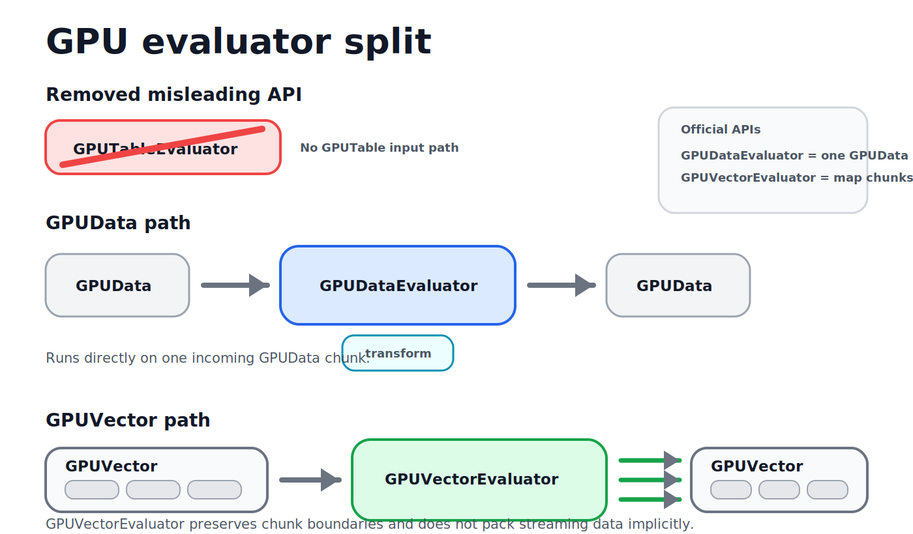

import {GPGPUDocsTabs} from '@site/src/components/docs/gpgpu-docs-tabs';

# GPU Evaluators

<GPGPUDocsTabs active="gpu-data-evaluator" />

`@luma.gl/gpgpu` has two evaluator layers:

- `GPUDataEvaluator` runs one lazy transform over one packed fixed-width `GPUData` chunk.
- `GPUVectorEvaluator` applies one lazy `GPUDataEvaluator` transform independently to every ordered `GPUData` chunk in a `GPUVector`.

There is no `GPUTable` evaluator input path. Streaming code should pass an incoming
`GPUData` chunk directly to `GPUDataEvaluator` operations, or wrap a `GPUVector`
with `GPUVectorEvaluator` when the same transform should preserve every existing
chunk boundary.



## Usage

### One incoming `GPUData`

```ts
import {GPUDataEvaluator, add} from '@luma.gl/gpgpu';

const offset = GPUDataEvaluator.fromConstant([1, 2, 3]);
const translatedChunk = add(incomingGPUData, offset);

const translatedVector = await translatedChunk.evaluate(device);
```

### One `GPUVector`

```ts
import {GPUDataEvaluator, GPUVectorEvaluator, add} from '@luma.gl/gpgpu';

const offset = GPUDataEvaluator.fromConstant([1, 2, 3]);
const translatedVector = GPUVectorEvaluator.fromGPUVector(vector).mapGPUData(data =>
  add(data, offset)
);

const outputVector = await translatedVector.evaluate(device);
```

`GPUVectorEvaluator` preserves `vector.data[]` order and chunk boundaries. It does
not combine streaming batches or pack buffers implicitly.

## `GPUDataEvaluator`

`GPUDataEvaluator` describes a 2D row layout backed by CPU values, one borrowed
`GPUData` chunk, another `GPUDataEvaluator`, or a lazy `Operation` output. Each
row contains `size` scalar elements of the same numeric type.

### `GPUDataEvaluatorProps`

| Property | Type | Description |
| --- | --- | --- |
| `id?` | `string` | Optional debug name used by `toString()`. |
| `type` | `SignedDataType` | Scalar element type, such as `'float32'` or `'uint32'`. |
| `size` | `number` | Number of scalar elements in each row. |
| `offset?` | `number` | Byte offset to the first element of the first row. Defaults to `0`. |
| `stride?` | `number` | Byte distance between adjacent rows. Defaults to `ValueType.BYTES_PER_ELEMENT * size`. |
| `normalized?` | `boolean` | Whether integer values are normalized when exposed as vertex formats. |
| `value?` | `TypedArray` | CPU-side data for the evaluator. |
| `buffer?` | `Buffer` | Borrowed GPU buffer backing this evaluator. |
| `gpuData?` | `GPUData` | Borrowed packed numeric GPUData chunk backing this evaluator. |
| `format?` | `GPUVectorFormat` | Optional memory format preserved for GPUVector interop. |
| `source?` | `Operation \| GPUDataEvaluator \| null` | Lazy source for this evaluator. |
| `isConstant?` | `boolean` | Whether every row shares the same value. Defaults to `false`. |
| `length?` | `number` | Row count. Optional when `isConstant` is `true` or `value` is provided. |

### Static Methods

#### `GPUDataEvaluator.fromArray(value, props?): GPUDataEvaluator`

Creates one evaluator from a typed array or numeric array. Plain JavaScript
arrays use `props.type` or `'float32'` by default. `Float64Array` inputs are
reinterpreted as `uint32` pairs for GPU-oriented operations such as `fround()`.

#### `GPUDataEvaluator.fromConstant(value, type?): GPUDataEvaluator`

Creates one constant evaluator with a shared row value. A scalar becomes a
one-element row, and an array becomes a row with `value.length` elements.

#### `GPUDataEvaluator.fromGPUData(data, options?): GPUDataEvaluator`

Creates one evaluator view over a packed fixed-width `GPUData` chunk. The input
must have a non-`vertex-list` `GPUData.format`, matching `rowByteLength`, and
packed rows. The evaluator borrows `data.buffer` and does not destroy it.

### Methods

#### `evaluate(device: Device, options?): Promise<GPUVector>`

Materializes one single-chunk `GPUVector` on the provided device. Lazy
dependencies are evaluated before the operation handler writes the output.

#### `readValue(startRow?: number, endRow?: number): Promise<TypedArray>`

Reads evaluator contents back to the CPU. This is intended for debugging or
inspection and may be slower than staying on the GPU.

#### `destroy(): void`

Releases cached GPU storage owned by this evaluator and prevents future
evaluation.

## `GPUVectorEvaluator`

`GPUVectorEvaluator` is the official `GPUVector` path. It wraps ordered
`GPUDataEvaluator` chunks and materializes one output `GPUVector` with the same
chunk boundaries.

### Static Methods

#### `GPUVectorEvaluator.fromGPUVector(vector): GPUVectorEvaluator`

Creates one chunk-preserving evaluator over a fixed-width `GPUVector`. The
vector must have at least one `GPUData` chunk and must not be interleaved.

#### `GPUVectorEvaluator.fromGPUDataEvaluators(evaluators, options?): GPUVectorEvaluator`

Creates one vector evaluator from already-built ordered chunk evaluators.

### Methods

#### `mapGPUData(transform): GPUVectorEvaluator`

Applies one lazy `GPUDataEvaluator` transform independently to each preserved
chunk. Use this for row-local streaming transforms that should not repack source
batches.

#### `evaluate(device: Device, options?): Promise<GPUVector>`

Materializes every chunk evaluator and returns one `GPUVector` with preserved
chunk order and boundaries.

#### `destroy(): void`

Releases cached GPU resources owned through child `GPUDataEvaluator` instances.

## Remarks

- Leaf operations accept `GPUDataEvaluator` or `GPUData`, not `GPUVector`.
- Use `GPUVectorEvaluator.fromGPUVector(vector).mapGPUData(...)` for vector-wide
  transforms that should preserve streaming chunks.
- `GPUDataEvaluator` operation outputs own their materialized single-chunk
  `GPUVector` backing resource.
- Borrowed `GPUData` chunks are not destroyed by `GPUDataEvaluator.destroy()`.
