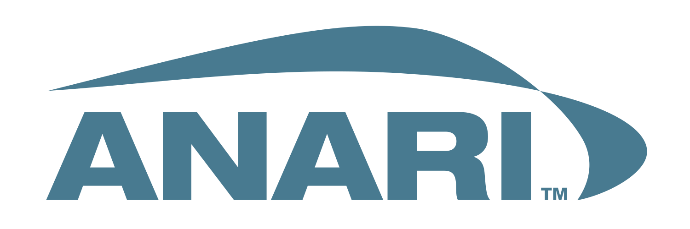
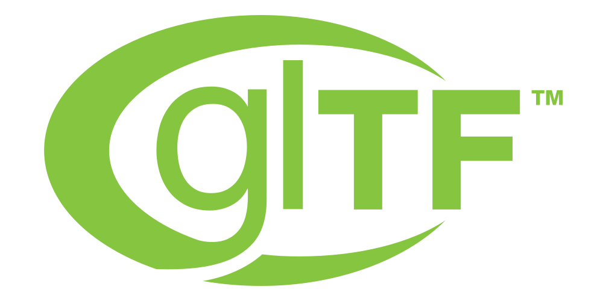

# @luma.gl/anari

<p align="center">
  <a href="https://www.khronos.org/anari/">
    
  </a>
</p>

<p align="center">
  <small>Experimental asset import</small><br />
  <a href="https://www.khronos.org/gltf/">
    
  </a>
  &nbsp;&nbsp;
  <a href="https://openusd.org/">
    
  </a>
</p>

<p className="badges">
  
  
  
</p>


A private, experimental, independently developed retained rendering interface implemented in the
spirit of ANARI on top of luma.gl.

> **Independent ANARI-inspired project:** This is not an official ANARI implementation. It is not
> certified or conformant with the ANARI specification and is not affiliated with or endorsed by
> The Khronos Group. ANARI and its logo are trademarks of The Khronos Group and are shown only to
> identify the standard that inspires this project.

Applications describe cameras, worlds, groups, instances, surfaces, geometry, materials, lights,
renderers, and frames. The luma.gl-backed device orchestrates existing shared scene renderers,
physically based shader modules, engine animation/morph helpers, portable WebGL/WebGPU render
passes, optional bloom, WebGPU software ray tracing, and HDR presentation when the WebGPU canvas is
configured for extended dynamic range. The ANARI facade adapts retained objects into shared renderer
descriptors; it does not define a second BRDF, renderer, or asset loader.

## Private workspace

`@luma.gl/anari` is a private luma.gl workspace and is not published to npm.

From a luma.gl checkout, install repository dependencies with `yarn install`. Other repository
workspaces can declare a dependency on the package with `"@luma.gl/anari": "workspace:*"`.

## Quick start

The following example assumes the page contains a `<canvas></canvas>` element:

```ts
import {ANARIDevice} from '@luma.gl/anari';
import {luma} from '@luma.gl/core';
import {webgpuAdapter} from '@luma.gl/webgpu';
import {Matrix4} from '@math.gl/core';

const canvas = document.querySelector('canvas');

if (!(canvas instanceof HTMLCanvasElement)) {
  throw new Error('Add a canvas element before starting the renderer');
}

const graphicsDevice = await luma.createDevice({
  adapters: [webgpuAdapter],
  createCanvasContext: {canvas}
});

const anari = new ANARIDevice(graphicsDevice);
const geometry = anari.newGeometry('sphere', {radius: 1});
const material = anari.newMaterial('physicallyBased', {
  baseColor: [0.18, 0.52, 0.96],
  metallic: 0.75,
  roughness: 0.22
});
const surface = anari.newSurface({geometry, material});
const group = anari.newGroup({surface: [surface]});
const instance = anari.newInstance({
  group,
  transform: new Matrix4().translate([0, 1, 0])
});
const directionalLight = anari.newLight('directional', {
  direction: [-1, -1, -0.5],
  irradiance: 2
});
const world = anari.newWorld({instance: [instance], light: [directionalLight]});
const camera = anari.newCamera('perspective', {
  position: [0, 2, 8],
  direction: [0, -1, -8]
});
const renderer = anari.newRenderer('default', {bloomIntensity: 0.65});
const frame = anari.newFrame({world, camera, renderer});

frame.render();
graphicsDevice.submit();
```

## Committed parameters

Parameter changes become visible after `commitParameters()`:

```ts
material.setParameter('roughness', 0.08).commitParameters();
camera.setParameters({position: [4, 2, 7], direction: [-4, -2, -7]}).commitParameters();
frame.render();
```

Object construction commits initial parameters automatically. Later updates are staged until the
changed object is committed.

## Supported objects

| Object | Subtypes |
| --- | --- |
| Geometry | `triangle`, `sphere`, `cylinder`, `cone`, `quad` |
| Material | `matte`, `physicallyBased` |
| Light | `ambient`, `directional`, `point`, `spot` |
| Camera | `perspective`, `orthographic` |
| Renderer | `default`, `deferred`, `debugNormals`, `debugDepth`, `raytrace`, and registered subtypes |

The scene hierarchy also supports arrays, surfaces, groups, transform instances, worlds, and
frames. Reusing one surface across many instances normally produces one instanced draw.

## Graph-based ray tracing

Select software ray tracing for an existing retained scene on a WebGPU device:

```ts
const renderer = anari.newRenderer('raytrace', {
  samplesPerPixel: 1,
  progressive: true,
  shadows: true
});

frame.setParameter('renderer', renderer).commitParameters();
frame.render();
```

The ANARI adapter translates committed objects for the shared `RayTracingSceneRenderer` in
`@luma.gl/experimental`. Its retained WebGPU command graphs build Morton-sorted object/instance
TLAS and per-mesh triangle BLAS hierarchies, derive tight transformed mesh bounds from BLAS roots,
and reuse existing hierarchy topology while instances animate. General-purpose `GPUSort`,
`GPUSegmentedSort`, `GPUBVH`, and `GPUSegmentedBVH` contributors fuse small work into single
workgroups, batch independent packed mesh permutations and hierarchies, and use stable multi-bit
radix passes for larger sorts. The adapter caches committed world descriptors and publishes
categorized scene revisions, so camera-only frames avoid repeated hierarchy traversal and full
transform serialization.
Traversal reuses cached inverse directions and queued box intersections. The tracer evaluates
direct lighting and shadows, progressively accumulates compatible history, adapts its internal
resolution, and presents HDR when configured. Retained `GPUTextureHistory` pairs rotate color and
surface metadata without full-frame copies; sparse updates carry only untouched pixels.
Every pass remains within default WebGPU CORE storage-buffer limits and leaves submission under
application control.

Hardware ray tracing, SAH/Karras hierarchy topology, indirect multi-bounce transport, denoising,
and volume rendering are not implemented. Skeletal/morph deformation, material textures,
alpha/transmission, and advanced PBR shading remain on the forward/deferred renderer paths.

Applications can register additional lazy renderer runtimes with
`anari.registerRenderer(subtype, runtimeFactory)`.

## HDR presentation

On an HDR-capable display, request an extended-range WebGPU canvas:

```ts
const supportsHighDynamicRange = window.matchMedia('(dynamic-range: high)').matches;

const graphicsDevice = await luma.createDevice({
  adapters: [webgpuAdapter],
  createCanvasContext: supportsHighDynamicRange
    ? {
        canvas,
        colorFormat: 'rgba16float',
        colorSpace: 'display-p3',
        toneMapping: 'extended'
      }
    : {canvas}
});
```

The ANARI renderer automatically preserves over-white highlights when the device uses
`rgba16float`. WebGL 2 and ordinary displays retain standard-dynamic-range rendering.

## Documentation

- [ANARI developer guide](https://luma.gl/docs/api-guide/engine/anari-rendering)
- [Complete ANARI API reference](https://luma.gl/docs/api-reference/anari)
- [ANARI materials, image maps, and lighting](https://luma.gl/docs/api-reference/anari/anari-materials-and-lights)
- [ANARI animation and optional glTF integration](https://luma.gl/docs/api-reference/anari/anari-animation)
- [ANARI C API and THREE.js mapping](https://luma.gl/docs/api-reference/anari/anari-api-mapping)

The reference covers device and object lifecycles, arrays, geometry, materials, lights, scene
hierarchy, cameras, renderers, frames, supported parameters, defaults, and current limitations.

## Showcase

The interactive showcase lives at `examples/showcase/anari`. Run it with
`yarn workspace luma.gl-examples-showcase-anari start`; add `?backend=webgl` to force the WebGL2
fallback instead of automatically selecting WebGPU. HDR-capable displays automatically use an
`rgba16float`, Display P3, extended-tone-mapping WebGPU presentation surface.

### JSON scene playground

Open `/playground.html` on the same development-server URL, or select **JSON LAB** from the
showcase. The private, experimental playground provides a deck.gl-style JSON editor with
`@@type` subtype declarations, named geometries and materials, retained surface references,
transform instances, animated lights, renderer-independent scene data, frame renderer controls, and
live HDR-capable rendering.

Three presets represent the complete **Chromatic Atlas**, **Crystal Cathedral**, and
**Celestial Engine** showcase scenes entirely in JSON, including procedural torus, crystal, and
beveled prism meshes, deterministic starfields, hundreds of retained instances, composable animations,
and real point lights following orbiting satellites. A Monaco editor provides syntax highlighting,
schema-aware completion, property descriptions, and exact error indicators. Live edits preserve the
last valid scene when JSON, parameter values, or retained object references are invalid.

The **GLTF ↓** and **USD ↓** actions export the currently valid scene as a static interchange
snapshot. Procedural meshes, starfields, and retained instances are baked into glTF 2.0 or ASCII
USD meshes with materials, textures, camera, and supported lights. ANARI animations and optional
renderer preset parameters for bloom, fog, and HDR presentation stay in the editable ANARI JSON.

The optional, experimental `@luma.gl/anari/schemas` entry point exports Zod schemas and the
generated draft-07 JSON Schema without adding Zod to imports of the core ANARI rendering API:

```ts
import {ANARISceneSchema, ANARI_SCENE_JSON_SCHEMA} from '@luma.gl/anari/schemas';

const result = ANARISceneSchema.safeParse(scene);
```

The editor associates `ANARI_SCENE_JSON_SCHEMA` with its JSON document for subtype-aware
IntelliSense. `ANARISceneSchema` additionally validates retained geometry, material, surface,
group, instance, and animated-light references that plain JSON Schema cannot express. The scene
format is experimental and is not an official ANARI serialization format.

### Experimental OpenUSD and glTF import

Both showcase pages include a 3D asset selector with production-quality CC0 glTF Animated Colors,
Antique Camera, Lantern, and Toy Car assets; a detailed public-domain OpenUSD Utah/Fancy teapot
atelier; an attributed Open Chess Set knight triptych; bundled CC0 USD vehicle assets; a composed
vehicle gallery; and a procedural material laboratory. Choosing an asset imports its meshes, material
bindings, transforms, retained instances, and supported lights into editable ANARI JSON. Imported
models receive a normalized studio presentation with animated cyan and amber point lights, glossy
materials, HDR emissive accents, and bloom.

The showcase glTF importer uses `@loaders.gl/gltf` and the canonical `@luma.gl/gltf` helpers,
preserving indexed meshes, RGB/RGBA vertex colors, `TEXCOORD_0`/`TEXCOORD_1`, authored tangent and
skin attributes, punctual lights, all 17 supported core/PBR-extension image maps, and source
material factors. Per-slot sampler addressing/filtering/mipmap settings, sRGB versus linear color
space, UV selection, and `KHR_texture_transform` matrices remain intact. `opaque`, `mask`, and
`blend` materials retain authored cutoff and double-sided settings.

The optional `@luma.gl/anari/gltf` entry point adapts glTF-owned node hierarchies and decoded clips
into editable ANARI JSON without importing a format loader into the core ANARI package:

```ts
import {makeANARIAnimationScene} from '@luma.gl/anari/gltf';

const animations = makeANARIAnimationScene(scene, {instances, geometries, materials, samplers});
animations.selectClip('Walk');
animations.update(performance.now() / 1000);
```

Scenes can optionally declare `nodes`, `clips`, and `playback`. Transform, material, UV, and morph
weight tracks reuse the shared engine animation mixer, preserve meshless parents and shared
surfaces, and commit each changed retained object once per frame. Position, normal, and tangent
morph deltas update existing vertex data without rebuilding the model. `update()` expects an
absolute timestamp in seconds. The playground provides clip selection, play/pause, scrubbing, and
playback speed controls.

Imported `JOINTS_0`/`WEIGHTS_0`, source joint nodes, and optional inverse bind matrices are
preserved. The showcase automatically creates mesh-local surface joint palettes and updates them as
imported skeletal clips play; each changed retained surface is committed at most once per frame.
Programmatic surfaces can also supply an explicit `skin: {jointMatrices}` descriptor when the
application owns the palette.
Animated glTF export remains unsupported; interchange export is currently static.

The format loader lives under `examples/showcase/anari/usd-loader` and follows the loaders.gl
loader contract so it can eventually move into a dedicated `@loaders.gl/usd` module. It currently
supports ASCII `.usda` / `.usd` stages and uncompressed `.usdz` packages with an ASCII root layer.
Binary USDC crates, complete USD layer composition, and arbitrary MaterialX/MDL shading networks
are not implemented. `UsdPreviewSurface` networks connected through `UsdUVTexture` are retained
as image samplers. The local-file picker supports standalone ASCII stages and
self-contained ASCII-root USDZ archives; loose external references require an accessible base URL.

## Status

This package is a proof of concept inspired by the ANARI object model. It is not an ANARI C API
binding and does not claim Khronos conformance.
